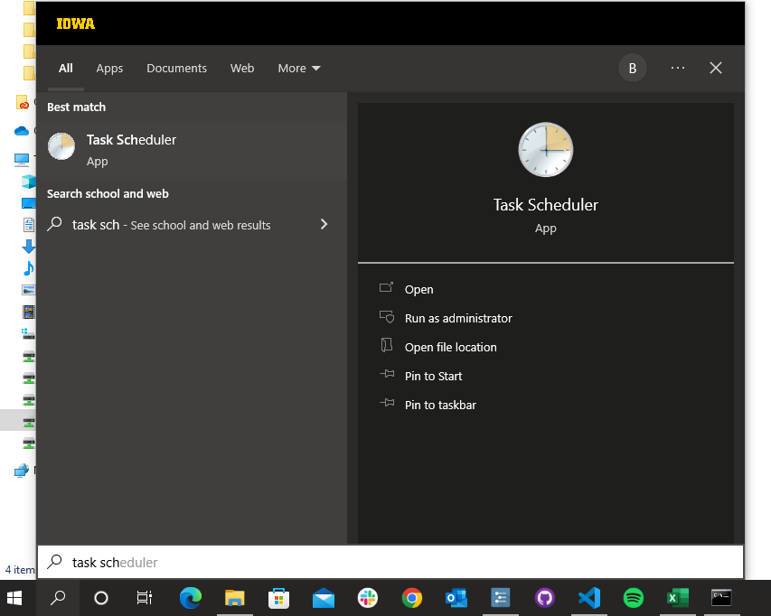
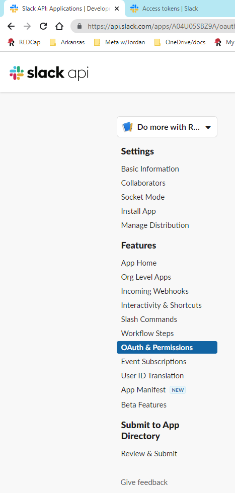

```{r setup, include = FALSE}
knitr::opts_chunk$set(
  echo = TRUE,
  error = TRUE,
  comment = "",
  class.source = "fold-show")
```

 > "*`R` will always be arcane to those who do not make a serious effort to learn it. It is not meant to be intuitive and easy for casual users to just plunge into. It is far too complex and powerful for that. But the rewards are great for serious data analysts who put in the effort.*"

— [Berton Gunter R-help August 2007](https://www.brodrigues.co/blog/2022-06-02-arcane/) (archived at https://perma.cc/KY9N-2FTT)

> "Evelyn Hall: I would like to know how (if) I can extract some of the information from the summary of my nlme.
> 
> Simon Blomberg: This is `R`. There is no if. Only how."

— [Evelyn Hall and Simon 'Yoda' Blomberg, R-help April 2005](https://www.brodrigues.co/blog/2022-06-02-arcane/) (archived at https://perma.cc/KY9N-2FTT)

# Learning `R` {#learn}

## Base R

Here are a slew of resources for learning base `R` (in addition to the documents in the lab's [Primer Articles folder](https://drive.google.com/drive/u/0/folders/1U0pNrjF2_tIPU6BiyCv0HqbOUA5P516r)):

- Use this Intro to `R`: https://www.statmethods.net/ (archived at https://perma.cc/SPQ2-DJKM)
    - I used this resource considerably when I was learning `R`
- Learn how to become a better coder: https://www.r-bloggers.com/10-top-tips-for-becoming-a-better-coder/ (archived at https://perma.cc/H3W7-QDAM)
- How to become fluent in `R`: https://www.sharpsightlabs.com/blog/are-you-fluent-r/ (archived at https://perma.cc/RWL5-GTWV)
- Video training courses in `R` skills: https://www.pluralsight.com/search?q=R (archived at https://perma.cc/U4ZZ-UE4X)
- Browse the `Cookbook for R` to find solutions to common tasks and problems: http://www.cookbook-r.com/ (archived at https://perma.cc/5ERJ-VRFR)
- Browse the `R Graph Gallery` to find examples of various graphs: <https://r-graph-gallery.com>
- Free `Codeacademy` course on `R`: https://www.codecademy.com/learn/learn-r (archived at https://perma.cc/JHS2-EYUU)
- Free `Coursera` courses on `R`: https://pairach.com/2012/12/22/learn-to-use-r-for-free-with-coursera/ (archived at https://perma.cc/XJ5U-5E4W)
- MOOCs and courses to learn `R`: https://www.r-bloggers.com/moocs-and-courses-to-learn-r/ (archived at https://perma.cc/MQ25-E3ME)
- Watch these videos from `Coursera`: https://blog.revolutionanalytics.com/2012/12/coursera-videos.html (archived at https://perma.cc/6FU4-PAQW)
- `RStudio` Webinars: https://www.rstudio.com/resources/webinars/ (archived at https://perma.cc/6RNR-98JB)
- UCLA Stats Website: https://stats.idre.ucla.edu/r/ (archived at https://perma.cc/M3N6-96RY)
- Take this Introduction to `R` course: https://www.datacamp.com/courses/free-introduction-to-r (archived at https://perma.cc/6ZM9-37L9)
- Teaching `R` in a Kinder, Gentler, More Effective Manner: https://github.com/matloff/TidyverseSkeptic (archived at https://perma.cc/QU9F-FBS8)
- Learn `R` interactively with `swirl`: https://swirlstats.com/ (archived at https://perma.cc/TT9V-U663)
- Use the `learnr` package: https://blog.rstudio.com/2017/07/11/introducing-learnr/ (archived at https://perma.cc/XGJ8-EXSN)
- You will sometimes find relevant articles on `R-bloggers`: https://www.r-bloggers.com/ (archived at https://perma.cc/EL3X-ZXBB)

## Statistics (using `R`)

The following are resources for learning statistics using `R`.

- UCLA Stats Website: https://stats.oarc.ucla.edu/other/dae/ (archived at https://perma.cc/FVG5-5X82)
- Free textbook on Learning Statistics with `R`: https://learningstatisticswithr.com (archived at https://perma.cc/SY87-5GCX)
- An excellent introductory textbook on Discovering Statistics using `R`: https://www.amazon.com/Discovering-Statistics-Using-Andy-Field/dp/1446200469 (archived at https://perma.cc/9LGU-7ZME)

## `tidyverse`

The following are resources for learning `tidyverse`, which is a collection of `R` packages for data management:

- https://www.tidyverse.org/learn/ (archived at https://perma.cc/5ZUM-XGES)

- https://www.linkedin.com/learning/learning-the-r-tidyverse/welcome?u=42459020 (archived at https://perma.cc/TD56-FX8R)

## Questions

If you have questions:

- Post to the `R` mailing list: https://stat.ethz.ch/mailman/listinfo/r-help
- Post to forums: https://stackoverflow.com/questions/tagged/r
- More info: https://www.r-bloggers.com/where-to-get-help-with-your-r-question/ (archived at https://perma.cc/P5TW-E7HP)

# Initial Set Up {#setup}

Note: many of these initial setup steps described below are not necessary for general use; many of these steps are necessary only for using lab-related repositories (e.g., to gain API access to export data from `REDCap`, to use absolute paths rather than relative paths so repos can communicate with each other, etc.).

1. Make sure you are logged onto a computer that can access the lab server (either a lab computer, or a computer you can VPN into the lab server), and that you have admin access to install and uninstall software
1. Install `R` (https://www.r-project.org/) into a directory that contains no spaces; On PC, change the location from the default `C:/Program Files/R/[R-VERSION]` (which contains a space) to `C:/R/[R-VERSION]` ([which does not contain any spaces](https://cran.r-project.org/doc/manuals/r-release/R-admin.html#Installing-R-under-Windows); archived at https://perma.cc/6VMX-3LYX---this is because [some packages that require compilation to install cannot read filepaths with spaces](https://cran.r-project.org/doc/manuals/r-release/R-admin.html#Installation); archived at https://perma.cc/XA3V-JTPY); may have to right click and "Run As Administrator"
    - If `R` was already installed in a directory that contains spaces (e.g., `C:/Program Files/R/[R-VERSION]`), uninstall `R` before installing it in a directory that doesn't contain spaces
1. Install `RStudio` Desktop (https://www.rstudio.com/products/rstudio/download/) in the main program files directory; may have to right click and "Run As Administrator".
`RStudio` is the best available graphical user interface for R.
1. Set the executables for `R` and `RStudio` to always run with administrator permissions.
    - If on Windows, open File Explorer and find the main executable of `R` (`C:/R/[R-VERSION]/bin/R.exe`) and `RStudio` (`C:\Program Files\RStudio\bin\RStudio.exe`).
    Right-click it to open the contextual menu.
    Then, click or tap on "Properties".
    In the Properties window, go to the Compatibility tab.
    At the bottom of the window, check the box next to the "Run this program as an administrator" option, and then click or tap on Apply or OK.
1. Install tools to allow you to compile `R` packages so you can install packages from source, if necessary (i.e., if package binaries are not available):
    - If on Windows, install [Rtools](https://cran.r-project.org/bin/windows/Rtools/); may have to right click and "Run As Administrator"
    - If on Mac, install [R Compiler Tools for Rcpp on MacOS](https://thecoatlessprofessor.com/programming/cpp/r-compiler-tools-for-rcpp-on-macos/) (archived at https://perma.cc/B35J-R22X)
1. Set up `git`, `GitLab`, and the `GitHub Desktop` App in the main program files directory; may have to right click and "Run As Administrator"; For instructions setting up and using `GitLab`, see here: https://devpsylab.github.io/DataAnalysis/git.html#toBegin
1. The `Rprofile.site` file in the `etc` folder of the `R` installation directory is the code that is run for ***every user*** at the beginning each time you load R.  We will update the default `Rprofile.site` file with the lab's `Rprofile.site` file so `R` installs packages in the correct location, sets the default package repository, updates packages, and gives you a fortune cookie.
To do this, perform the following steps:
    - Rename the `Rprofile.site` file in the `R` installation directory (`C:/R/R-[InsertVersionNumber]/etc/Rprofile.site`) to be `Rprofile_BACKUP.site`
    - Download the lab's `Rprofile.site` file located in this repository at the following location (https://research-git.uiowa.edu/PetersenLab/R-InitialSetup/-/blob/master/R%20Setup%20Files/Rprofile.site), and paste it into the `R` installation directory (PC: `C:/R/R-[InsertVersionNumber]/etc/Rprofile.site`; Mac: `/Library/Frameworks/R.framework/Versions/[InsertVersionNumber]/Resources/etc/Rprofile.site`)
1. The `.Rprofile` file in the user's `Documents` folder is the code that is run for ***the particular user*** at the beginning each time you load R.
We will update the default `.Rprofile` file (if there is one) with the lab's `.Rprofile` file so `R` knows which computer you are using and which path to use (relative to where your `R` projects are located).
To do this, perform the following steps:
    - Download the lab's `.Rprofile` template file in this repository at the following location, and make sure to remove anything besides `.Rprofile` in the filename: https://research-git.uiowa.edu/PetersenLab/R-InitialSetup/-/blob/master/R%20Setup%20Files/.Rprofile
    - Open the lab's `.Rprofile` file, and revise it with your HawkID
    - Revise the lab's `.Rprofile` file with the local path to the `Documents` folder for each of the computers you will use to access `R` (e.g., home computer, work computer, laptop).
    Make sure to use forward slashes (`/`), not back slashes (`\`) in the path.
    - You will save the file in your `HOME` directory.
    To find the `HOME` directory, open `R` and type the following command: `Sys.getenv("HOME")`—the output of the command is the location of your `HOME` directory; If this is a lab computer, it may be located here: `//home.iowa.uiowa.edu/[user]/Documents`.
    If this is your personal computer, it may be located here: PC: `C:/Users/[user]/Documents`; Mac: `/Users/[user]`.
    Then close R.
    - If your `HOME` directory is in a OneDrive folder (or another cloud-based sync folder), you will want to change the directory of your `HOME` path so that it is not in a OneDrive folder.
    To do that, open [`Environment Variables`](https://superuser.com/questions/949560/how-do-i-set-system-environment-variables-in-windows-10) (archived at https://perma.cc/A2E5-B5VA) in Windows.
    Then, add/edit `HOME` as the "variable name" with the intended location as the "variable value" (e.g., `C:/Users/[user]/Documents`, where you replace "user" with your HawkID).
        - You may also solve this issue by placing the following command in the `Rprofile.site` from the previous step
            - `Sys.setenv("HOME" = "C:/Users/[specific user ID])/Documents")`
    - Move the revised `.Rprofile` file to the `HOME` directory and overwrite the original `.Rprofile` file (if it exists).
    You may have to show hidden files in order to see the file (PC: see Windows Explorer settings; Mac: Command+Shift+Dot).
    - Make sure to show filename extensions in your file explorer window, and make sure the file is named `.Rprofile` (not `.Rprofile.Rprofile`).
    Make sure there is a period at the beginning of the filename.
1. Run `RStudio`.
If the `Rprofile.site` and `.Rprofile` files are correctly set up, they should pre-populate your `path` location when you open R.
If the contents of the `Global Environment` in `RStudio` are empty, your `Rprofile.site` and/or `.Rprofile` files are not set up correctly.
    - If you get this error (`Error: could not find function "install.packages"`), run the following line manually and then restart `RStudio` after the package finishes installing: `install.packages("fortunes")`
1. For [reproducibility purposes](#dontSaveWorkspace), prevent `R`/`RStudio` from saving your workspaces automatically using the following steps:
    - With RStudio running, choose `Tools → Global Options` from the menus.
    - In the Options dialog, change the value for `Save workspace to .RData on exit` to `Never`.
    - Click `OK`.
1. Install the `petersenlab` `R` package using the following steps:
    - Install the `remotes` package using the following command: `install.packages("remotes")`
    - Install the `petersenlab` package using the following command: `remotes::install_github("DevPsyLab/petersenlab")`
1. Request an [API token](https://redcap.icts.uiowa.edu/redcap/api/help/?content=tokens) for the following REDCap project(s); note: please check with Dr. P before requesting an API token.
In general, RAs should not have an API token.
    - [School Readiness Study](https://redcap.icts.uiowa.edu/redcap/redcap_v12.4.1/index.php?pid=4941)
    - [School Readiness Study Screening](https://redcap.icts.uiowa.edu/redcap/redcap_v12.4.1/index.php?pid=4958)
    - [201701837 - Mechanisms in the Development of Self-Regulation, School Readiness, and Behavior Problems [Data Extraction]](https://redcap.icts.uiowa.edu/redcap/redcap_v12.4.1/index.php?pid=11233)
    - [School Readiness Study - Prospective Participants](https://redcap.icts.uiowa.edu/redcap/redcap_v12.4.1/index.php?pid=10440)
1. When your API token has been approved for these projects, open the `Encrypt REDCap Token.R` script:
https://research-git.uiowa.edu/petersenlab/R-InitialSetup/blob/master/REDCap%20Credentials/Encrypt%20REDCap%20Token.R
1. Revise the API tokens to reflect yours, then run the script to save your encrypted credentials on the lab server and your encryption key on your local computer
    - Verify that the Encryption Key (`REDCap Encryption Key.RData`) was saved where you intended it to be saved on your local computer
    - Verify that a file named with your HawkID was saved here: `//lc-rs-store24.hpc.uiowa.edu/lss_itpetersen/Lab/Studies/School Readiness Study/Data Management/REDCap/Tokens/`
1. Copy the Encryption Key (`REDCap Encryption Key.RData`) to the comparable location of any other computers you own that you plan to access the data from
    - The file has to be in the comparable location (relative to the `path` variable you set in `Rprofile.site`) of every computer in order for it to be found by the `Export Data.R` script.
    The default location is: `file.path(path, "GitHub/R/Data/REDCap Encryption Key.RData")`, so if `path` is set as `"C:/User/YourName"`, the file would be saved in: `C:/User/YourName/GitHub/R/Data/REDCap Encryption Key.RData`.
    The recommended location for `GitHub` repos is to create a folder titled `GitHub` in your `Documents` folder, and to put repos in the `GitHub` folder; it is *NOT* recommended to put `git` repos in a OneDrive folder because [`git` files tend not to play nice with syncing services](https://stackoverflow.com/questions/19305033/why-is-putting-git-repositories-inside-of-a-dropbox-folder-not-recommended) (archived at https://perma.cc/XZ6F-43G3; e.g., OneDrive, Dropbox)
1. Add the SRS Data Processing repo from the lab drive to your `GitHub Desktop` App (`//lc-rs-store24.hpc.uiowa.edu/lss_itpetersen/Lab/Studies/School Readiness Study/Data Processing`)
    - For instructions, see the section on "[How to add a pre-existing repo from the lab drive (RDSS/network share) to your computer](https://research-git.uiowa.edu/PetersenLab/R-InitialSetup/-/blob/master/GitLab/GitLab%20Instructions.md#how-to-add-a-pre-existing-repo-from-the-lab-drive-rdssnetwork-share-to-your-computer)" here: https://research-git.uiowa.edu/petersenlab/R-InitialSetup/blob/master/GitLab/GitLab%20Instructions.md
1. Open `RStudio` by using "Run as Administrator" (always open `RStudio` as an administrator so it has write access to the program files directory);
1. Open the `Export Data.R` script in R:
https://research-git.uiowa.edu/petersenlab/srs/SRS-DataProcessing/blob/master/1.%20Export%20Data/Export%20Data.R
`\\lc-rs-store24.hpc.uiowa.edu\lss_itpetersen\Lab\Studies\School Readiness Study\Data Processing\1. Export Data\Export Data.R`
1. Ensure your HawkID and location of your encryption key in the script are correct, and then run the script to verify that you can export data from REDCap
1. For antialiased plots in `RStudio`, change the Graphics backend to `Cairo`:
`Tools → Global Options → Graphics`

# Lab Package {#petersenlab}

The [`petersenlab` package](https://devpsylab.github.io/petersenlab) is here: https://devpsylab.github.io/petersenlab.
To install the [`petersenlab` package](https://devpsylab.github.io/petersenlab), see instructions [here](dataManagement.html#labFunctions).

# Install Packages {#installPackages}

To install and load `R` packages, see the instructions [here](dataManagement.html#loadInstallPackages).

# Update Packages {#updatePackages}

To update packages, use the following code:

```{r, class.source = "fold-show", eval = FALSE}
update.packages(checkBuilt = TRUE)
```

One indication that the packages might not be updating to the latest version is seeing the same packages showing as needing an update after having run the `update.packages()` function.
If this does not update the package(s) to the latest version, you may need to install the latest version of the package(s) from source (see the section on "[Initial Set Up](#setup)" of `R` for the software needed to install R packages from source):

```{r, class.source = "fold-show", eval = FALSE}
update.packages(checkBuilt = TRUE, type = "source")
```

# Update `R` {#updateR}

Instructions adapted from: https://mirror.las.iastate.edu/CRAN/bin/windows/base/rw-FAQ.html#What_0027s-the-best-way-to-upgrade_003f (archived at https://perma.cc/W5QW-MA6Q)

1. Uninstall `R`
1. Install the new `R` version into a directory that contains no spaces (see Step 2 in the [Initial Set Up](#setup) section above)
1. [You only need to do this step if you installed packages in the R-version-specific "Library" folder rather than the common/shared "Packages" folder—that is, you don't need to do this step if you used the lab's `Rprofile.site` file, as described above, which installs packages to the common/shared "Packages" folder]:
    - Copy installed packages in the "Library" folder to the "Library" folder in the new installation
1. In new `R` version folder, copy the current `Rprofile.site` file as a backup (`Rprofile_BACKUP.site`) and overwrite the original file with the lab's version of `Rprofile.site` from here: https://research-git.uiowa.edu/PetersenLab/R-InitialSetup/-/blob/master/R%20Setup%20Files/Rprofile.site
    - `R` will run the file named `Rprofile.site` at initial runtime.
1. Set the executables for `R` and `RStudio` to always run with administrator permissions.
    - If on Windows, open File Explorer and find the main executable of `R` (`C:\R\R-VERSION\bin\R.exe`) and `RStudio` (`C:\Program Files\RStudio\bin\RStudio.exe`).
    Right-click it to open the contextual menu.
    Then, click or tap on "Properties".
    In the Properties window, go to the Compatibility tab.
    At the bottom of the window, check the box next to the "Run this program as an administrator" option, and then click or tap on Apply or OK.
1. Make sure you have the latest version of the tools necessary to compile packages from source (i.e., Rtools for Windows or `R` Compiler Tools for Rcpp on MacOS; see the instructions in the section on [initial set up](#setup))
1. Open the new `R` version and run `update.packages(checkBuilt = TRUE, ask = FALSE)`, and install any necessary packages
1. Close R
1. Delete anything left of the old installation

# Style Guide and Best Practices {#bestPractices}

## Create `Rstudio Project`

For each data analysis project (i.e., each [`GitLab`/`GitHub`](#git) repo), create an RStudio Project.
This helps keep your project files organized.

## Use `R` Notebooks for "Computational Notebooks"

Using `R` Notebooks for "Computational Notebooks" is helpful for reproducible code that can be shared with others.
To create computational notebooks see the `Markdown` section on [computational notebooks](markdown.html#computationalNotebook) in the Data Analysis guides.

## Separate sections in code

- In `R` scripts, use sections.
    - To insert a section in `RStudio`, use `CTRL-Shift-R` or "Code" - "Insert Section"
- In `R` Notebooks/Markdown, use Headers and code chunks.
    - Headers: 1, 2, or 3 pound signs
    - Code Chunks: `Ctrl+Alt+I`; or click "Insert" button then "R"

## Naming variables

- Use meaningful variable names; we want to know what a variable represents without having to consult an external codebook for every variable
- Variable names should include the prefix for the measure followed by an underscore
    - e.g., `cbcl_` for the Child Behavior Checklist variables
- Use lower camel case for variable naming
    - e.g., `prefix_thisIsTheVariableName`
- Do **not** include spaces in variable names

## Comment code frequently and clearly!

It is important to comment code frequently and clearly.
You want you (and others) to easily be able to understand your code if you come back to it several years later!

## Don't save your workspace image {#dontSaveWorkspace}

For reproducibility purposes, it is important [**not** to save your workspace image](https://www.r-bloggers.com/2017/04/using-r-dont-save-your-workspace/) (archived at https://perma.cc/9SCZ-L4DE).
It is best practices to begin `R` each session with a clean workspace.
If there is a `.Rdata` file in the same folder as the `Rstudio Project`, Rstudio will automatically load the objects into the workspace at the beginning of the session.
This is problematic because those objects can interact/interfere with the code and can lead to problems with replicability for others who are running the code without those objects in the workspace.
When you exit `RStudio`, `RStudio` asks if you want to "Save workspace image to `[filepath]/.Rdata`?"
Make sure to select "Don't Save"!
However, do make sure to save your `R` scripts before exiting Rstudio.

# Data Management

- The lab's [Data Analysis Guides on Data Management](dataManagement.html)
- Tidyverse: https://www.tidyverse.org
- University of Iowa Workshops

# Saving Plots

`png(); dev.off()`

- The lab's [Data Analysis Guides on Figures](figures.html)

# Saving Output

`R Markdown`

- The lab's [Data Analysis Guides on Markdown](markdown.html)
- https://rmarkdown.rstudio.com/lesson-1.html (archived at https://perma.cc/8SQH-N68X)
- https://www.rstudio.com/wp-content/uploads/2015/02/rmarkdown-cheatsheet.pdf (archived at https://perma.cc/3NMT-4L25)
- https://bookdown.org/yihui/rmarkdown/ (archived at https://perma.cc/UJC8-ZZVC)

# Shortcuts

- Run selected line(s) of code: Ctrl + Enter
- Comment/uncomment code: Ctrl + Shift + C
- Pipe: Ctrl + Shift + M
- Insert Code Chunk: Ctrl + Alt + I
- Assignment operator: Alt + - (alt-dash)
- Select multiple lines: Ctrl + Alt, up or down; or Alt + drag mouse
- Search: Ctrl + Shift + F
- Show all keyboard shortcuts: Alt + Shift + K

# Statistics Examples

- [Bayesian Analysis](bayesian.html)
- [Data Management](dataManagement.html)
- [Developmental Scaling](developmentalScaling.html)
- [Exploratory Data Analysis](eda.html)
- [Factor Analysis](factorAnalysis.html)
- [Hierarchical Linear Modeling](hlm.html)
- [Item Response Theory](irt.html)
- [Longitudinal Data Analysis](lda.html)
- [Mediation](sem.html#mediation)
- [Moderation/Interaction](regression.html#moderation)
- [Multiple Imputation](multipleImputation.html)
- [Principal Component Analysis](pca.html)
- [Regression](regression.html)
- [Structural Equation Modeling](sem.html)

# Running Scripts Automatically with Windows

https://www.spsanderson.com/steveondata/posts/2023-06-29/index.html (archived at https://perma.cc/9EXK-W99Y)

`R` scripts can be run automatically.
For example, it can be helpful to have an `R` markdown report run automatically before the day begins.

1. Open the `Notepad` app and create a file with the following syntax.
   - `Location of R executable file\R CMD BATCH "Path location of script that should be automatically run"`
   - **Example:** 
   - `C:\R\4.1.3\bin\R CMD BATCH "R:\Lab\Studies\School Readiness Study\Data Processing\5. Reports\automatic_reports\Run_Reports_auto.R"`
1. Save the file as a `.bat` file in the desired location
1. Once the `.bat` file has been created, search `Windows Task Scheduler` in the search bar

1. In the `Actions` selection bar, select `Create basic Task...`
1. Name the task and provide a description
1. Next, set the trigger for the new task (i.e., how often the task should run)
1. Set the action for the task by selecting `Start a program`
1. Under, `Program/script` browse to the `.bat` file that was created in step 1 and select `Next`
1. Click `Finish` and the script is now configured to run automatically
1. **Note: When `R` is updated, the path to the `bin` folder within `R` needs to be updated to reflect an accurate absolute path to R.**
    - Example: `C:\R\4.1.3\bin\R CMD BATCH` changed to `C:\R\4.3.0\bin\R CMD BATCH`

## Troubleshooting

### Pandoc error

This error may appear if you are attempting to render a markdown file

```
pandoc version 1.12.3 or higher is required and was not found.
```

The solution to this problem [can be found at this link](https://stackoverflow.com/questions/28432607/pandoc-version-1-12-3-or-higher-is-required-and-was-not-found-r-shiny) (archived at https://perma.cc/YX57-BPRS)

# Reading Password Protected Excel Databases

A helpful post can be found here: <br>

https://stackoverflow.com/questions/35852722/how-do-you-read-a-password-protected-excel-file-into-r (archived at https://perma.cc/U32Z-22VE)

```{r, eval = FALSE}
install.packages("excel.link")

library("excel.link")

passwordProtectedBook <- xl.read.file(file.path("full path to workbook"), #Full path to workbook
password = "pass", #password
write.res.password="pass") #writing the reset password
```

# Sending slacks with `R`

Occasionally, it can be helpful to send a Slack message using `R`.
For example, if a script does not run, a Slack message can be sent to inform the appropriate team members.
[These instructions](https://www.infoworld.com/article/3402657/how-to-slack-from-r.html) (archived at https://perma.cc/9CWJ-J5ZT) can largely be followed to set up `R` to send Slack messages.
However, there are some differences:

1. When setting up the configuration file, use the below template.
The slack API token should be placed in the `token` category.
    - Note the token will need to be updated every 30 days.
    You can generate a new token by navigating to the [Slack API](https://api.slack.com/apps) and selecting `Oauth & Permissions`
    - 

```
token: YOUR_FULL_API_TOKEN
channel: #general
username: slackr
incoming_webhook_url: https://hooks.slack.com/services/XXXXX/XXXXX/XXXXX
```

Once the configuration is complete, it is possible to send messages. 
For now, we have found it helpful to embed the slacks in the `tryCatch` function. 

```{r, eval = FALSE}
tryCatch(
CODE YOU WANT TO RUN,
error = function(e)
{
  #message to send if the code doesn't run
  my_message <- paste( "example message")
  slackr_msg(my_message, channel = "#recruitment")
})
```

## Slacking Specific Users

It is also possible to slack specific users with instructions found [at this link](https://stackoverflow.com/questions/32419756/how-do-you-tag-people-with-a-slack-bot) (archived at https://perma.cc/59U5-V4GQ).

# Replacing `//n` with a space

Many notes in projects that are exported from REDCap come with spaces denotes as `//n`.
Use the below code to make these fields more readable in the future.

```{r, eval = FALSE}
gsub('\\n', ', ', df$notesField)
```

# Working with `R` on a Network Drive

When working with `R` on a network drive, it may be helpful to configure the project to store `.Rproj.user` on the local `C:/` drive rather than on the network drive, which results in slow execution times.

For more info:

- https://github.com/rstudio/rstudio/pull/14875
- https://github.com/rstudio/rstudio/issues/14619#issuecomment-2189855598
- https://github.com/rstudio/rstudio/issues/10417#issuecomment-2199930385

# Package Development

## Working with `renv` for Package Management

`renv` is used for reproducibility, by helping with package management (tracking package versions, etc.):

https://rstudio.github.io/renv/articles/renv.html

### Updating the Package

To update the package, run the following in `R`:

```{r, eval = FALSE}
# 1. Update packages in package environment
renv::upgrade()
renv::update()
renv::snapshot()

# 2. Add/edit code

# 3. Update documentation
roxygen2::roxygenise()

# 4. Update package version
usethis::use_version()
```

Then, build the package: Ctrl-Shift-B

Then, install the package:

```{r, eval = FALSE}
renv::install("C:/R/Packages/petersenlab") #PC
renv::install("/Library/Frameworks/R.framework/Packages/petersenlab") #Mac
```

### Installing Packages

To install new packages in the package environment, run the following in `R`:

```{r, eval = FALSE}
renv::install("NAME_OF_PACKAGE")
```
or:
```{r, eval = FALSE}
install.packages("NAME_OF_PACKAGE)
```

## `R CMD check` {#rCmdCheck}

1. Build the source package
    - click on the "Build" tab in the top-right pane of RStudio, and then click "Build Source Package"
1. Open terminal in RStudio
    - After the package is built, open a terminal window directly in RStudio by clicking on the "Terminal" tab at the bottom of RStudio
1. Run `R CMD check --as-cran`
    - In the terminal window, navigate to the directory where your package source is located.
    Then, run `R CMD check --as-cran` followed by the name of your package tarball. For example:

Build `.tar.gz` file:

```{r, eval = FALSE}
devtools::build(pkg = "D:/Documents/GitHub/petersenlab")
```

```{r, eval = FALSE}
R CMD check --as-cran petersenlab_1.0.0.tar.gz
```

If errors compiling the PDF manual:

```{r, eval = FALSE}
R CMD Rd2pdf . --output=man/figures/manual.pdf --force --no-preview --no-clean
```

### Troubleshooting

#### `no visible binding for global variable`; `Undefined global functions or variables`

For example:
```r
no visible binding for global variable
    'moderatorVal_centered'
  Undefined global functions or variables:
    moderatorVal_centered predictorVal_centered
```

Solution: set each variable to `NULL` in the package function before it is mentioned.
For example:

```r
predictorVal_centered <- moderatorVal_centered <- NULL
```

## `R CMD check` via GitHub Actions

```{r, eval = FALSE}
usethis::use_github_action("check-standard")
```

## Useful keyboard shortcuts for package authoring:

 Install Package:           'Ctrl + Shift + B'
 
 Check Package:             'Ctrl + Shift + E'
 
 Test Package:              'Ctrl + Shift + T'

```{r, eval = FALSE}
renv::install("C:/R/Packages/petersenlab")
renv::snapshot()
renv::install()
```

## `pkgdown`

Run once to configure your package to use pkgdown:

```{r, eval = FALSE}
usethis::use_pkgdown()
```

Then use `pkgdown` to build your website:

```{r, eval = FALSE}
pkgdown::build_site()
```

## Steps to Add Functions

1. Add `.R` file with the function
1. Add the function to the `_pkgdown.yml` file
1. Update version number
1. `renv::upgrade()`
1. `renv::update()`
1. `renv::snapshot()`
1. `roxygen2::roxygenise()`
1. Install Package: 'Ctrl + Shift + B'
1. Check Package: 'Ctrl + Shift + E'
1. `R CMD check`
1. Commit and push changes
1. Update release version in GitHub

## Add sub-packages

```{r, eval = FALSE}
devtools::build(pkg = "D:/Documents/GitHub/petersenlab/inst/extdata/testpackage1")
devtools::build(pkg = "D:/Documents/GitHub/petersenlab/inst/extdata/testpackage2")

install.packages("D:/Documents/GitHub/petersenlab/inst/extdata/testpackage1_0.1.0.tar.gz", repos = NULL, source = TRUE)
install.packages("D:/Documents/GitHub/petersenlab/inst/extdata/testpackage2_0.1.0.tar.gz", repos = NULL, source = TRUE)

remotes::install_local("D:/Documents/GitHub/petersenlab/inst/extdata/testpackage2_0.1.0.tar.gz")
remotes::install_local("D:/Documents/GitHub/petersenlab/inst/extdata/testpackage2_0.1.0.tar.gz")
```

## Submit Package to CRAN

https://cran.r-project.org/submit.html

## Resources

Official documentation for CRAN:

- https://cran.r-project.org/doc/manuals/R-exts.html

Unofficial documentation:

- https://rpubs.com/YaRrr/rpackageintro
- https://r-pkgs.org
- https://cran.r-project.org/doc/contrib/Leisch-CreatingPackages.pdf
- https://portal.stats.ox.ac.uk/userdata/ruth/APTS2012/Rcourse10.pdf
- https://web.mit.edu/insong/www/pdf/rpackage_instructions.pdf
- https://hilaryparker.com/2014/04/29/writing-an-r-package-from-scratch/

### For Package Development Tasks

- https://usethis.r-lib.org/index.html

### For Documentation

- https://github.com/r-lib/roxygen2#roxygen2
- https://hilaryparker.com/2014/04/29/writing-an-r-package-from-scratch/

### Creating Vignettes

- https://bookdown.org/yihui/rmarkdown-cookbook/package-vignette.html

### For Licensing

- https://usethis.r-lib.org/reference/licenses.html
