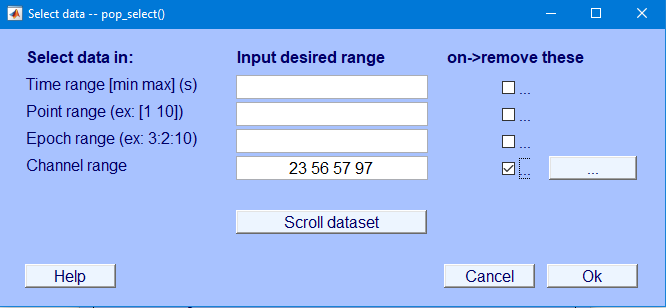

```{r setup, include = FALSE}
knitr::opts_chunk$set(echo = TRUE,
                      error = TRUE,
                      comment = "")
```

# To-do

- Ben:
    - clean up pre-processing steps
    - create folder structure for intermediate files;
    - save intermediate files after automatic processing steps and before each manual processing step
    - ~~figure out batch processing~~
    - ~~Create electronic forms for EEG processing~~
    - Separate the "Behavior/Bad Channel" forms by task in REDCap
        - Create new instruments, designate events, have separate instruments
    - Better describe the missingness for files
        - We need a systematic way to identify new ways to process the missingness
        - Find a way to best describe and report the ways of missingness
    - Add what cases should be processed on a report
    - Go through the maxmem edits on the clean_rawData question. We want a standardized value on the machines
    - ~~Edit the automatic script to use the absolute drive path~~
    - Look at the warning messages for the automatic script updates
        - mff import file
        - automatic cleaning of files problems

- Alexis:
    - figure out and get code for AMICA procedure
    - try MADE pipeline from [Debnath et al. (2020)](https://onlinelibrary.wiley.com/doi/full/10.1111/psyp.13580)
    - get code for automated ICA rejection
    - figure out optimal threshold for automated ICA rejection with our data
- Decide on settings for automated artifact rejection
- Decide on whether/how to use automated ICA rejection
- Evaluate the semi-automated pipelines from:
    - [Debnath et al. (2020)](https://onlinelibrary.wiley.com/doi/full/10.1111/psyp.13580)
    - [Desjardins et al. (2021)](https://www.sciencedirect.com/science/article/pii/S0165027020303848)
    - [Flo et al. (2022)](https://www.sciencedirect.com/science/article/pii/S1878929322000214)
    - [Gabar-Durnam et al. (2018)](https://www.frontiersin.org/articles/10.3389/fnins.2018.00097/full)
    - [Haresign et al. (2021)](https://www.sciencedirect.com/science/article/pii/S1878929321001146)
    - [Kumaravel et al. (2022)](https://www.sciencedirect.com/science/article/pii/S1878929322000123)

- Finalize order of processing

# Processing Steps

https://eeglab.org/tutorials/

1. Filtering
1. Average Referencing
1. Artifact Rejection
    1. Automated artifact rejection (save intermediate file)
    1. Manual selection of bad channels
    1. Manual selection of bad time periods (save intermediate file)
    1. Removal of manually selected bad channels
    1. Removal of manually selected bad time periods (save intermediate file)
    1. [Independent Component Analysis](#ica) (ICA)
        1. Run ICA
        1. Automated removal of bad ICA components
        1. Re-run ICA (save intermediate file)
        1. Manual selection of bad ICA components (save intermediate file)
        1. Removal of manually selected bad ICA components
1. Interpolation of Bad Channels
1. Average Referencing
1. Segmentation
1. Baseline Correction (save final file)

# EEGLAB

## Install Plugins

MFFMatlabIO plugin

## Import Data

File → Import Data → Using EEGLAB functions and plugins → Import Magstim/EGI .mff file

```matlab
EEG = pop_mffimport({'\\\\iowa.uiowa.edu\\Shared\\ResearchData\\rdss_itpetersen\\Lab\\Studies\\School Readiness Study\\Data\\LV2\\ERP\\Oddball\\0-Raw Data (mff)\\1613_90_oddball.mff'},{'code'},0,0);

[ALLEEG EEG CURRENTSET] = pop_newset(ALLEEG, EEG, 1,'overwrite','on','gui','off');
```

Select `.mff` file(s)

Event type field (may select multiple): `code`

## Filter Data

Filter → Basic FIR Filter

0.1 -- 30 Hz

save as new name

```matlab
EEG = pop_eegfiltnew(EEG, 'locutoff',0.1,'hicutoff',30,'plotfreqz',1);
```

## Average Referencing

Tools → Re-reference the data → Compute average reference

```matlab
EEG = eeg_checkset( EEG );
EEG = pop_reref( EEG, []);
[ALLEEG EEG CURRENTSET] = pop_newset(ALLEEG, EEG, 1,'setname','1613_90_oddball_fil_ref','overwrite','on','gui','off'); 
eeglab redraw;
```

## Artifact Rejection

### Automated Artifact Rejection

Tools → Reject data using Clean Rawdata and ASR

```matlab
EEG = eeg_checkset( EEG );
EEG = pop_clean_rawdata(EEG, 'FlatlineCriterion',5,'ChannelCriterion',0.8,'LineNoiseCriterion',4,'Highpass','off','BurstCriterion',20,'WindowCriterion',0.25,'BurstRejection','on','Distance','Euclidian','WindowCriterionTolerances',[-Inf 7] );
[ALLEEG EEG CURRENTSET] = pop_newset(ALLEEG, EEG, 1,'gui','off'); 
eeglab redraw;
```

Currently, we run into a bug that yields the following error:

```
Not enough memory, This is not a bug (Error occurred in function asr_process() at line 132)
```

As a workaround, type the following code in MATLAB to edit the function:

```matlab
edit clean_artifacts
```

Then, change the number in the following line to a larger number (e.g., 256) and click save:

```matlab
{'max_mem','MaxMem'}, 256, ...
```

### Selection of Bad Channels

View data to identify bad channels to reject.

Edit → Select data

Specify channels to reject

Specify "on -> remove these"

```matlab
EEG = eeg_checkset( EEG );
EEG = pop_select( EEG, 'nochannel',{'E44','E56','E57','E113'});
[ALLEEG EEG CURRENTSET] = pop_newset(ALLEEG, EEG, 1,'setname','1613_90_oddball_fil_ref_chn','overwrite','on','gui','off'); 
eeglab redraw;
```

### Selection of Bad Time Periods

Plot → Channel data (scroll)

Change voltage scale to 50

Settings → Time range to display

Change to 10 seconds

Settings → Number of channels to display

Change to number of channels to view at one time (e.g., 64)

To erase a selected portion of the data, first drag the mouse (holding down the left mouse button) horizontally across the time region of interest to mark it for rejection.
To deselect a portion of the data, simply click on the selected region.

After marking some portions of the data for rejection, press REJECT and a new data set will be created with the rejected data omitted.
A new dataset will be created with the marked regions removed.
Your goal is to reject non-stereotypic artifacts.
Do not reject blinks/saccades, because [independent component analysis](#ica) will remove those.

Clicking "Stack" stacks all electrodes on top of each other to more easily identify noisy data.

Click "REJECT" to remove the bad time periods from the data file.

### Independent Component Analysis {#ica}

https://eeglab.org/tutorials/06_RejectArtifacts/RunICA.html

https://socialsci.libretexts.org/Bookshelves/Psychology/Book%3A_Applied_Event-Related_Potential_Data_Analysis_(Luck)/14%3A_Appendix_3%3A_Example_Processing_Pipeline

The component order returned by `runica.m` is in decreasing order of the EEG variance accounted for by each component.

Tools → Decompose data by ICA

```matlab
EEG = eeg_checkset( EEG );
EEG = pop_runica(EEG, 'icatype', 'runica', 'extended',1,'interrupt','on');
[ALLEEG EEG] = eeg_store(ALLEEG, EEG, CURRENTSET);
eeglab redraw;
```

Plot → Component maps → 2D

Visually identify independent components to remove

Tools → Inspect/label components by map

Example ICA Artifact Components


Example ICA Brain Components


Overview of ICA Components


Toggle the "Accept" button to reject an independent component, press "OK" to specify it for rejection

Automated detection of artifactual ICA components:

https://eeglab.org/tutorials/06_RejectArtifacts/RunICA.html#automated-detection-of-artifactual-ica-components

```matlab
EEG = eeg_checkset( EEG );
EEG = pop_iclabel(EEG, 'default');
[ALLEEG EEG] = eeg_store(ALLEEG, EEG, CURRENTSET);
EEG = eeg_checkset( EEG );
EEG = pop_icflag(EEG, [NaN NaN;0.9 1;0.9 1;NaN NaN;NaN NaN;NaN NaN;NaN NaN]);
[ALLEEG EEG] = eeg_store(ALLEEG, EEG, CURRENTSET);
eeglab redraw;
```

There are six categories of components: Brain, Muscle, Eye, Heart, Line Noise, Channel Noise, and Other

Our goal is to keep the brain components and to remove everything else (i.e., artifacts).

Tools → Classify components using ICLabel → Label components

Tools → Classify components using ICLabel → Flag components as artifacts

Substracting rejected ICA components:

https://eeglab.org/tutorials/06_RejectArtifacts/RunICA.html#subtracting-ica-components-from-data

Tools → Remove components

```matlab
EEG = pop_subcomp( EEG, [1    2    6    7   10   13   21   24   26   31   32   33   36   43   44   51   54   55   59   61   67   68   74   83   90   91   93   99  103  112  113  116  118  121], 0);
[ALLEEG EEG CURRENTSET] = pop_newset(ALLEEG, EEG, 6,'gui','off'); 
eeglab redraw;
```

## Interpolate Bad Channels

https://sccn.ucsd.edu/pipermail/eeglablist/2016/011199.html

To interpolate channels you would load up one file that has only the good
channels, then load up a second file that has the full channel list, and then run the
channel interpolation function from the eeglab gui.

Tools → Interpolate Electrodes → Use all channels (or specific channels?) of other dataset

Using all channels of other dataset:

**Important Note:** Interpolating files will re-reference the data.
Average reference the data after interpolating channels.

```matlab
EEG = eeg_checkset( EEG );
EEG = pop_interp(EEG, ALLEEG(3).chanlocs, 'spherical');
[ALLEEG EEG CURRENTSET] = pop_newset(ALLEEG, EEG, 4,'gui','off'); 
eeglab redraw;
```

Using specific channels of other dataset:

```matlab
EEG = eeg_checkset( EEG );
EEG = pop_interp(EEG, ALLEEG(3).chanlocs([44   56   57  113]), 'spherical');
[ALLEEG EEG CURRENTSET] = pop_newset(ALLEEG, EEG, 1,'gui','off'); 
eeglab redraw;
```

Removed channels:

```matlab
EEG = eeg_checkset( EEG );
EEG = pop_interp(EEG, EEG.chaninfo.nodatchans([44  56  57  113]), 'spherical');
[ALLEEG EEG CURRENTSET] = pop_newset(ALLEEG, EEG, 3,'gui','off'); 
EEG = eeg_checkset( EEG );
eeglab redraw;
```

Data channels:

```matlab
EEG = eeg_checkset( EEG );
EEG = pop_interp(EEG, [44  56  57  113], 'spherical');
[ALLEEG EEG CURRENTSET] = pop_newset(ALLEEG, EEG, 1,'gui','off'); 
eeglab redraw;
```

## Average Referencing

Tools → Re-reference the data → Compute average reference

```matlab
EEG = eeg_checkset( EEG );
EEG = pop_reref( EEG, []);
[ALLEEG EEG CURRENTSET] = pop_newset(ALLEEG, EEG, 1,'setname','1613_90_oddball_fil_ref','overwrite','on','gui','off'); 
eeglab redraw;
```

## Segmentation

Tools → Extract Epochs

```matlab
EEG = eeg_checkset( EEG );
EEG = pop_epoch( EEG, {  'frq+'  'tgt+'  }, [-0.2           1], 'newname', '1613_90_oddball_fil_ref epochs', 'epochinfo', 'yes');
[ALLEEG EEG CURRENTSET] = pop_newset(ALLEEG, EEG, 1,'overwrite','on','gui','off'); 
```

## Baseline Correction

```matlab
EEG = eeg_checkset( EEG );
EEG = pop_rmbase( EEG, [-200 0] ,[]);
[ALLEEG EEG CURRENTSET] = pop_newset(ALLEEG, EEG, 1,'overwrite','on','gui','off'); 
eeglab redraw;
```

# Automatic Script example 

```matlab
% Starting EEG Lab 
[ALLEEG EEG CURRENTSET ALLCOM] = eeglab;

%% Helpful documentation is located here
% https://eeglab.org/tutorials/11_Scripting/Using_EEGLAB_history.html
% https://eeglab.org/tutorials/ConceptsGuide/Data_Structures.html


%Loading in the Dataset
EEG = pop_mffimport({'R:\\Lab\\Studies\\School Readiness Study\\Data\\LV2\\ERP\\Oddball\\0-Raw Data (mff)\\1613_90_oddball.mff'},{'code'},0,0);
EEG.setname='raw';
EEG = eeg_checkset( EEG );
%Storing the current dataset
[ALLEEG, EEG] = eeg_store( ALLEEG, EEG, 1);
% refreshing the graphical interface
eeglab redraw;

%Filter the data
EEG = pop_eegfiltnew(ALLEEG(1), 'locutoff',0.1,'hicutoff',30,'plotfreqz',1);
%Save the Filtered dataset 
%ALLEEG EEG CURRENTSET seems to just be a name for all of the current data
%sets 
%pop_newset seems to save the dataset in both memory and in the toolkit
[ALLEEG, EEG, CURRENTSET] = pop_newset(ALLEEG, EEG, 2,'setname','fil','savenew','R:\\Lab\\Studies\\School Readiness Study\\Data\\LV2\\ERP\\Oddball\\MATLAB\\1-Filtering (fil)\\tcid_wave.set','gui','off'); 
eeglab redraw;

% Average referencing
%EEG = eeg_checkset( EEG );
EEG = pop_reref( ALLEEG(2), []);
[ALLEEG EEG CURRENTSET] = pop_newset(ALLEEG, EEG, 3,'setname','Avg Ref','savenew','R:\\Lab\\Studies\\School Readiness Study\\Data\\LV2\\ERP\\Oddball\\MATLAB\\9-Average Reference (ref)\\tcid_wave_avg.set','gui','off');
eeglab redraw;

% Rejecting the artifacts
% testing bumping the 
EEG = pop_clean_rawdata(ALLEEG(3), 'FlatlineCriterion',5,'ChannelCriterion',0.8,'LineNoiseCriterion',4,'Highpass','off','BurstCriterion',30,'WindowCriterion',0.25,'BurstRejection','on','Distance','Euclidian','WindowCriterionTolerances',[-Inf 7] );
%Saving cleaned dataset
[ALLEEG EEG CURRENTSET] = pop_newset(ALLEEG, EEG, 4,'setname','clean data','savenew','R:\\Lab\\Studies\\School Readiness Study\\Data\\LV2\\ERP\\Oddball\\MATLAB\\10-Clean Artificats (clean)\\tcid_wave_clean.set','gui','off'); 
eeglab redraw;

% Placeholder to manually remove bad channels


% ICA components
EEG = pop_runica(ALLEEG(4), 'icatype', 'runica', 'extended', 1,'interrupt','on');
[ALLEEG EEG CURRENTSET] = pop_newset(ALLEEG, EEG, 5,'setname','ICA test','savenew','R:\\Lab\\Studies\\School Readiness Study\\Data\\LV2\\ERP\\Oddball\\MATLAB\\11-ICA\\tcid_wave_ICA.set','gui','off'); 
eeglab redraw;

%Manually reject ICA components
EEG = pop_subcomp( EEG, [1    2    6    7   10   13   21   24   26   31   32   33   36   43   44   51   54   55   59   61   67   68   74   83   90   91   93   99  103  112  113  116  118  121], 0);
[ALLEEG EEG CURRENTSET] = pop_newset(ALLEEG, EEG, 6,'gui','off'); 
eeglab redraw;

% Place holder to remind to manually remove the channels that we would
% like to reject
% taking the EEG channel lock of the first (raw) dataset
EEG = eeg_checkset( EEG );
EEG = pop_interp(ALLEEG(5), ALLEEG(1).chanlocs, 'spherical');
[ALLEEG EEG CURRENTSET] = pop_newset(ALLEEG, EEG, 6,'setname','Interpolated','savenew','R:\\Lab\\Studies\\School Readiness Study\\Data\\LV2\\ERP\\Oddball\\MATLAB\\12-Interpolate\\tcid_wave_Interpolate.set','gui','off'); 
eeglab redraw;

% Segmenting the Data
EEG = eeg_checkset( EEG );
EEG = pop_epoch( ALLEEG(6), {  'frq+'  'tgt+'  }, [-0.2 1], 'newname', 'tcid_wave_segmented', 'epochinfo', 'yes');
[ALLEEG EEG CURRENTSET] = pop_newset(ALLEEG, EEG, 7,'setname','Segmented','savenew','R:\\Lab\\Studies\\School Readiness Study\\Data\\LV2\\ERP\\Oddball\\MATLAB\\13-Segment\\tcid_wave_Segment.set','gui','off'); 
eeglab redraw;

% Baseline Correcting the Data
EEG = eeg_checkset( EEG );
EEG = pop_rmbase( ALLEEG(7), [-200 0] ,[]);
[ALLEEG EEG CURRENTSET] = pop_newset(ALLEEG, EEG, 8,'setname','Baseline Correct','savenew','R:\\Lab\\Studies\\School Readiness Study\\Data\\LV2\\ERP\\Oddball\\MATLAB\\14-Baseline-Correct\\tcid_wave_baseline-correct.set','gui','off'); 
eeglab redraw;

```

# Automatic script that loops files

## Warning messages with script

Warning messages appeared when using the automatic cleaning of data.
We may have to send a dataset to someone so they can check on it.
Some documentation is found here:

* https://sccn.ucsd.edu/pipermail/eeglablist/2021/016222.html
* https://sccn.ucsd.edu/wiki/EEGLAB_bug1971


## Filterning, average referencing, and automatically cleaning the data.

This script batch reads in files, filters them, average references, and automatically cleans them.
After that, this script reads in the cleaned files for manually processing to remove bad time periods and bad channels

```matlab
%10/20/22 Working script that reads everything into matlab


%%%%%%%%%%%%%%%%%%%%%%%%%%%%%%%%%%%%%%%%%%%%%%%%%%%%%%%%%%%%%%%%%%%%%%%%%
%Location of Raw oddball files
rawOddballFiles = '\\iowa.uiowa.edu\Shared\ResearchData\rdss_itpetersen\Lab\Studies\School Readiness Study\Data\LV2\ERP\Oddball\MATLAB\0-Raw\';
%Location of path to save cleaned files
cleanAutoPath = '\\iowa.uiowa.edu\Shared\ResearchData\rdss_itpetersen\Lab\Studies\School Readiness Study\Data\LV2\ERP\Oddball\MATLAB\10-Clean Artificats (clean)\';

%all oddball files in the directory to be processed
filesInDirectory = dir(fullfile(rawOddballFiles, '*.mff')); %Reading the files in the directory

%Listing the number of subjects for the number of times to loop
numberOfSubject = height(filesInDirectory);

%Names of all the files in the directory
listOfSubjects={filesInDirectory.name}; 

%splitting the filename up
filenameSplit = regexp(listOfSubjects, '_', 'split');  
id = cellfun(@(x) x{1},filenameSplit,'un',0);  %getting the id's
wave = cellfun(@(x) x{2},filenameSplit,'un',0); %getting the waves


[ALLEEG EEG CURRENTSET ALLCOM] = eeglab;

for i=1:numberOfSubject

    %%%% Importing Data
    path = [rawOddballFiles,filesInDirectory(i).name];
    tcid = char(strcat(id(i),'_', wave(i))); %combining the TCID and wave

    EEG = pop_mffimport({path},{'code'},0,0);
    % Saving the data in memory
   [ALLEEG EEG CURRENTSET] = pop_newset(ALLEEG, EEG, i,'setname', tcid,'gui','off');

    % Filtering the data
    EEG = pop_eegfiltnew(ALLEEG(i), 'locutoff',0.1,'hicutoff',30,'plotfreqz',1);
    [ALLEEG EEG CURRENTSET] = pop_newset(ALLEEG, EEG, i,'overwrite','on','gui','off');
    
    % Average Referencing
    EEG = pop_reref( ALLEEG(i), []);
    [ALLEEG EEG CURRENTSET] = pop_newset(ALLEEG, EEG, i,'overwrite','on','gui','off');

    % They strongly advise importing channel locations before using this
    % function.
    %Cleaning the Data
    EEG = pop_clean_rawdata(ALLEEG(i), 'FlatlineCriterion',5,'ChannelCriterion',0.8,'LineNoiseCriterion',4,'Highpass','off','BurstCriterion',30,'WindowCriterion',0.25,'BurstRejection','on','Distance','Euclidian','WindowCriterionTolerances',[-Inf 7]);
    nameClean = [tcid,'_autoClean.set'];
    savePathClean = [cleanAutoPath,nameClean];
    [ALLEEG EEG CURRENTSET] = pop_newset(ALLEEG, EEG, i,'setname', nameClean, 'savenew', savePathClean, 'gui','off', 'overwrite', 'on');


end
eeglab redraw:

%% Reading in automatically cleaned datasets

%%%%%%%%%%%%%%
% Clear Data becasue to overwrite anything in memory
%%%%%%%%%%%%%%
ALLEEG = [];
EEG = [];

% Adding the path for cleaned files
cleanAutoPath = '\\iowa.uiowa.edu\Shared\ResearchData\rdss_itpetersen\Lab\Studies\School Readiness Study\Data\LV2\ERP\Oddball\MATLAB\10-Clean Artificats (clean)\';

%Starting EEGLAB
[ALLEEG EEG CURRENTSET ALLCOM] = eeglab;


%Location of cleaned oddball data
filesInDirectoryClean = dir(fullfile(cleanAutoPath, '*.set')); %Reading the files in the directory


%Listing the number of subjects for the number of times to loop
numberOfSubjectClean = height(filesInDirectoryClean);

%Names of all the files in the directory
listOfSubjectsClean = {filesInDirectoryClean.name}; 

%splitting the filename up
filenameSplitClean = regexp(listOfSubjectsClean, '_', 'split');  
id = cellfun(@(x) x{1},filenameSplitClean,'un',0);  %getting the id's
wave = cellfun(@(x) x{2},filenameSplitClean,'un',0); %getting the waves


for i=1:numberOfSubjectClean

    %%%% Importing Data
    tcidClean = char(strcat(id(i),'_', wave(i), '_autoClean.set')); %combining the TCID and wave to name the file
    EEG = pop_loadset('filename', tcidClean, 'filepath', cleanAutoPath); 
    [ALLEEG EEG CURRENTSET] = pop_newset(ALLEEG, EEG, i,'setname', tcidClean,'gui','off');

end
eeglab redraw;
```

## Removing bad time periods and channels

1. In the now open EEGLAB interface, select a dataset.
Go to `Tools` > `Inspect/reject data by eye` 


1. Go through the raw signal and manually reject bad time periods


1. Select `REJECT` and overwrite the file in memory
   * select `Overwrite it in memory (set=yes; unset=create a new dataset)`
1. Visually inspect the data and select any bad channels, and write them down
1. Next, manually reject the channels by selecting `Edit` then `Select Data`


1. Manually enter the channels to be removed in the `Channel range` field and select the checkbox under `on->remove these` and select `Ok`
1. Save the file as `tcid_wave_manualClean.set` in the following drive path 
    * `\\iowa.uiowa.edu\Shared\ResearchData\rdss_itpetersen\Lab\Studies\School Readiness Study\Data\LV2\ERP\Oddball\MATLAB\11-Manually Cleaned`
    * This screenshot represents removing channels `23 56 57 97`

1. Repeat step for each cleaned dataset

## Running the ICA

This script runs the ICA.
We'll want to think about how to automatically reject the components here.
Once this runs, see the [ICA section](#ica) to reject components.
Tools → Inspect/label components by map is how to reject components.

```matlab
% Running the ICA

%% Reading in the manually cleaned datasets

%%%%%%%%%%%%%%
% Clear Data becasue to overwrite anything in memory
%%%%%%%%%%%%%%
ALLEEG = [];
EEG = [];

% Adding the path for cleaned files
manualCleanPath = '\\iowa.uiowa.edu\Shared\ResearchData\rdss_itpetersen\Lab\Studies\School Readiness Study\Data\LV2\ERP\Oddball\MATLAB\11-Manually Cleaned\';

%Starting EEGLAB
[ALLEEG EEG CURRENTSET ALLCOM] = eeglab;


%Location of cleaned oddball data
filesInDirectoryManualClean = dir(fullfile(manualCleanPath, '*.set')); %Reading the files in the directory


%Listing the number of subjects for the number of times to loop
numberOfSubjectManualClean = height(filesInDirectoryManualClean);

%Names of all the files in the directory
listOfSubjectsManualClean = {filesInDirectoryManualClean.name}; 

%splitting the filename up
filenameSplitManualClean = regexp(listOfSubjectsManualClean, '_', 'split');  
id = cellfun(@(x) x{1},filenameSplitManualClean,'un',0);  %getting the id's
wave = cellfun(@(x) x{2},filenameSplitManualClean,'un',0); %getting the waves


for i=1:numberOfSubjectManualClean

    %%%% Importing Data
    tcidClean = char(strcat(id(i),'_', wave(i), '_manualClean.set')); %combining the TCID and wave to name the file
    EEG = pop_loadset('filename', tcidClean, 'filepath', manualCleanPath); 
    [ALLEEG EEG CURRENTSET] = pop_newset(ALLEEG, EEG, i,'setname', tcidClean,'gui','off');

    %%% Running the ICA
    EEG = eeg_checkset( EEG );
    EEG = pop_runica(EEG, 'icatype', 'runica', 'extended',1,'interrupt','on');
    [ALLEEG EEG] = eeg_store(ALLEEG, EEG, CURRENTSET);
    eeglab redraw;

end
eeglab redraw;
```

# EP Toolkit

## Reading Text Files to EP Toolkit

To read and combine single subject averaged test files, follow these steps: 

1. Open the toolkit and select `Read`
1. Use the following options
    * Format = `text (.txt)`
    * Type = `average`
    * Mont = `Adult Hydrocel 128-channel 1.0`
1. Select `Single File Mode`.
    * Single file mode will use the filename to assign the task condition and participant ID for each file.
        * Note: `R` can rename files in batches
    Thus, **it is critical to use a standard naming convention to name the files**. 
    For example, an oddball file could be named: 
        * `frq_1001_36` and `tgt_1001_36`
1. In the `Single File Mode` menu use the `Subject` field to denote which characters in the filename name will determine the participant ID. 
    * For the above example `5:11` would coorespond to `1001_36`
1. Next, In the `Single File Mode` menu use the `Cell` field to denote which characters in the file name will determine the task condition. 
    * * For the above example `1:3` would coorespond to `frq` or `tgt`
    * 
1. Select `Read` and select the `GSN-Hydrocel-129.ced` when prompted
1. The new file will have the participant ID and will combine the conditions for each participant. 
    * Subject Names: 
        * 
    * Task Conditions
        * 


