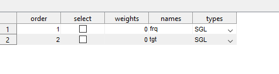
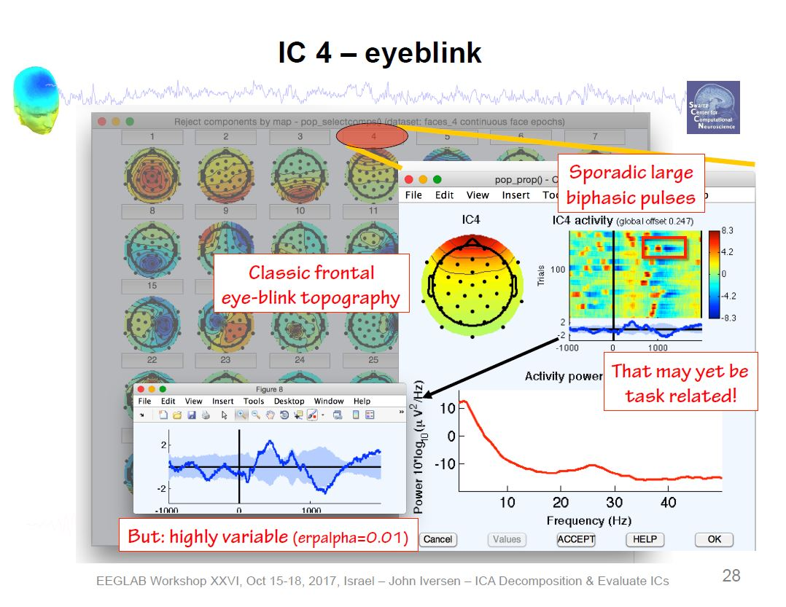

```{r setup, include = FALSE}
knitr::opts_chunk$set(
  echo = TRUE,
  error = TRUE,
  comment = "")
```

# Extracting Behavioral Data from `E-Prime`

1. Run E-Merge
1. Navigate to the folder with the task data
1. Select `Merge`
1. Select `Recursive Merge`
1. Only merge: `All specified files regardless of merge status`
1. Save target file (`filename.emrg2`)
1. Double click the newly saved file (`filename.emrg2`) to open it in E-DataAid
1. Go to `File`, `Export`
1. Make sure `SPSS` is selected and that the `Unicode` option is **unselected**: https://mattkmiecik.com/posts/post-Stop-Using-Excel-to-Preprocess-E-Prime-Data/post-Stop-Using-Excel-to-Preprocess-E-Prime-Data.html (archived at https://perma.cc/N734-4W9X)
1. Save the file as: `filename.txt`

# ERP Processing Pipeline using HAPPE

1. Download MATLAB: https://its.uiowa.edu/matlab
    - Click `How to Install MatLab` and follow the relevant instructions
    - Create a `MatLab` folder in your local directory.
    You will keep all of your MatLab related files in this folder.
1. Install the HAPPE pipeline: https://github.com/PINE-Lab/HAPPE
    - Clone the HAPPE repository to your `GitHub` account
    - Open the `HAPPE` folder
    - Open the `HAPPE User Guide` document
    - Read through the `HAPPE User Guide`
    - Navigate to the `Setting up HAPPE` section in the user guide and follow the instructions for setting up the HAPPE pipeline, including installation of add-ons and eeglab
1. Install EP Toolkit: https://sourceforge.net/projects/erppcatoolkit/
    - After downloading, copy the `EP_Toolkit` folder to your `Matlab` folder (in your local directory)
    - In the `EP_toolkit` folder: 
        - Open `EP_Toolkit`
        - Open `Documentation`
        - Open `tutorial`
    - In the `tutorial` document, navigate to the `Set Up` section and follow the instructions for installing and setting up EP Toolkit and FieldTrip.
    Do **NOT** follow instructions for setting up EEGLAB.
    You have already set up your path to EEGLAB when you set up the HAPPE pipeline.
    - You should have the following subfolders in your `MatLab` folder:
        - `EP_Toolkit`
        - `Fieldtrip-[version number]`
1. Open the HAPPE pipeline V4 script in MATLAB
    - Follow the User Guide instructions for the HAPPE-ER pipeline, using the user inputs described below.

## Oddball Task

1. User Inputs
    - Enter the path to the folder containing the dataset.
    All ERP files are stored on the lab drive (`\\lc-rs-store24.hpc.uiowa.edu\lss_itpetersen\Lab\Studies\School Readiness Study\Data\LV2\ERP`)
    - Select `raw`
    - Load pre-existing set of input parameter: 
        - `N` if this is your first time running data through the pipeline.
        - `Y` if you have decided on a set of parameters.
        Enter the path to the folder containing the input parameters.
    - Low density data: `N`
    - Data type: `task`
    - Performing event-related potential (ERP) analysis: `Y`
    - Enter the task onset tags
        - Target: `tgt+`
        - Frequent: `frq+`
        - `done`
    - Do multiple onset tags belong to a single condition? `N`
    - File format: `5`
    - Acquisition layout type: `2`
    - Number of channels: `128`
    - Do you have additional type fields besides "code"? `N`
    - Select channels of interest: `all`
    - Frequency of electrical noise in Hz: `60`
    - Are there any additional frequencies, (e.g., harmonics) to reduce? `N`
    - Line Noise reduction method: `notch`
        - Low cutoff: `59`
        - high cutoff: `61`
    - Resample: `N`
    - Filter
        - Low Pass Cutoff: `30`
        - High Pass Cutoff: `.1`
    - Choose a filter: `fir`
    - Bad Channel Detection: `Y`
        - `after` wavelet thresholding
    - ECGone: `N`
    - Wavelet Thresholding
        - `default`
        - Threshold rule: `hard`
    - MuscIL: `N`
    - Segmentation: `Y`
        - Starting parameter for stimulus: `-200`
        - Ending parameter for stimulus: `1000`
        - Task offset: `2`
    - Baseline Correction: `Y`
        - Baseline Correction start: `-200`
        - Baseline Correction end: `0`
    - Interpolation: `Y`
    - Segment Rejection: `Y`
        - Segment Rejection Method: `amplitude`
            - minimum segment rejection threshold: `-150`
            - maximum segment rejection threshold: `150`
            - segment rejection based on all channels or ROI: `all`
    - Re-referencing: `Y`
        - Does your data contain a flatline or all zero reference channel? `N`
        - re-referencing method: `average`
    - Save format: `1`
    - Visualizations: `N`
    - Parameter file save name: `default`

## Fish/Shark

1. User Inputs
    - Enter the path to the folder containing the dataset.
    All ERP files are stored on the lab drive (`\\lc-rs-store24.hpc.uiowa.edu\lss_itpetersen\Lab\Studies\School Readiness Study\Data\LV2\ERP`)
    - Select `raw`
    - Load pre-existing set of input parameter: 
        - `N` if this is your first time running data through the pipeline.
        - `Y` if you have decided on a set of parameters.
        Enter the path to the folder containing the input parameters.
    - Low density data: `N`
    - Data type: `task`
    - Performing event-related potential (ERP) analysis: `Y`
    - Enter the task onset tags
        - Correct Go: `cGo++`
        - Incorrect Go: `xGo++`
        - Correct NoGo: `cNoGo++`
        - Incorrect NoGo: `xNoGo++`
        - `done`
    - Do multiple onset tags belong to a single condition? `N`
    - File format: `5`
    - Acquisition layout type: `2`
    - Number of channels: `128`
    - Do you have additional type fields besides "code"? `N`
    - Select channels of interest: `all`
    - Frequency of electrical noice in Hz: `60`
    - Are there any additional frequencies, (e.g., harmonics) to reduce? `N`
    - Line Noise reduction method: `notch`
        - Low cutoff: `59`
        - high cutoff: `61`
    - Resample: `N`
    - Filter
        - Low Pass Cutoff: `30`
        - High Pass Cutoff: `.1`
    - Choose a filter: `fir`
    - Bad Channel Detection: `Y`
        - `after` wavelet thresholding
    - ECGone: `N`
    - Wavelet Thresholding
        - `default`
        - Threshold rule: `hard`
    - MuscIL: `N`
    - Segmentation: `Y`
        - Starting parameter for stimulus: `-200`
        - Ending parameter for stimulus: `1000`
        - Task offset: `17`
    - Baseline Correction: `Y`
        - Baseline Correction start: `-200`
        - Baseline Correction end: `0`
    - Interpolation: `Y`
    - Segment Rejection: `Y`
        - Segment Rejection Method: `amplitude`
            - minimum segment rejection threshold: `-150`
            - maximum segment rejection threshold: `150`
            - segment rejection based on all channels or ROI: `all`
    - Re-referencing: `Y`
        - Does your data contain a flatline or all zero reference channel? `N`
        - re-referencing method: `average`
    - Save format: `1`
    - Visualizations: `N`
    - Parameter file save name: `default`

## Stop-Signal

# MATLAB Scripts to Manage HAPPE Files

We have scripts for each task that can prepare files for the HAPPE Pipeline and/or manage the files outputted from HAPPE.
These actions can be done manually as well, but the MATLAB scripts make the process more efficient.
The scripts will also generate a "log" of all of the files processed through HAPPE to facilitate tracking of EEG data processing.
The sections below detail the code used to perform these actions as well as the instructions for using the current scripts.

Note: Before using the scripts/code detailed below, ensure that all filepaths used are in your MATLAB path collection.
These may include:
   - The location where the automatic script is stored (for our lab, this is under `/Data Processing/6. MATLAB EEG Pipeline`)
   - The location where the HAPPE pre-processing script is stored
   - The location of the raw data (to be processed)
   - The location(s) of any intermediate files for processing (e.g., the updated .mff files that contain accuracy information in FishShark)
   - The location(s) for any files outputted by HAPPE and/or places you wish to use the script to move them to

## Oddball (Pre-HAPPE) 
1. Update all thresholds and filepaths in script file (must be done BEFORE running the script)
   - In the second section of our script file, we set our "threshold" for the minimum number of trials that need to be retained after pre-processing for a subject's data to be eligible for PCA.
   Additional thresholds can also be set for things like number of channels retained, but these are not currently in use.
   
   ```
   % Set quality threshold parameters
   trialCutoff = 10;
   ```
   - We also set environment variables with all of the filepaths that are relevant for managing HAPPE output files and tracking processed data.
   The following paths should be checked and updated as necessary to reflect the organization of processing on your computer.
      - `passPath` is the location you wish to have files that meet or exceed the above-defined thresholds to be saved
      - `allPath` is the location you wish to have ALL files outputted from HAPPE saved to (regardless of whether threshold is met or not)
      - `failPath` is the location you wish to have files that do not meet the above-defined thresholds to be copied to
         - .mff files that do not meet threshold will be copied here as an indication that they should be processed manually to see if they meet threshold afterward
      - `summPath` is the location you wish to save the file that lists all files processed through HAPPE in the current batch
         - We currently use this to save the "processing log" to a location that all team members/computers have access to so it is easier to determine which files require processing when EEG data are not stored on a shared server
    
    ```
    % Set paths for file sorting
    passPath = 'V:\Processing-Repo\Folder Structure\3 - Files for PCA'; %location for .txt output files
    allPath = 'V:\Processing-Repo\Folder Structure\2 - Processed Files'; %location for all processed files to end up
    failPath = 'V:\Processing-Repo\Folder Structure\1b - Manual Processing'; %location to copy unsuccessful .mff to for manual process

    % Set path for processing summary
    summPath = 'Z:\Shared Server\Study Folder\Data Processing\6. MATLAB EEG Pipeline\Processed Data Logs';
    ```
1. Run the HAPPE Pipeline
   - This first section is designed to rely on user input.
   Press "Run" on the MATLAB editor window with the file open to begin the process.
   - A message will appear in the console prompting you to enter the filepath to the location of the HAPPE pre-processing file you wish to run
   - Once the path is entered, MATLAB will run the file

   ```
   % Set path to HAPPE pre-processing script
   happeRun = input('Enter the full path to the HAPPE pre-processing file:\n> ','s') ;

   % Call and run HAPPE pre-processing script
   run(happeRun);
   ```
1. Enter HAPPE inputs
   - See the above section for HAPPE user inputs for Oddball

At this point, no more user interaction is required for the script to do its job.
The HAPPE pipeline will run, and the remaining MATLAB code in the script file will evaluate the files outputted by HAPPE and move them to the appropriate locations based on this evaluation.
See [General Post-Happe Steps](#generalPost) for examples of the MATLAB code and an explanation of what it does.

## FishSharks (Pre-HAPPE)

1. Update all thresholds and filepaths in script file (must be done BEFORE running the script)
   - In the fifth section of our script file, we set our "threshold" for the minimum number of trials that need to be retained after pre-processing for a subject's data to be eligible for PCA.
   Additional thresholds can also be set for things like number of channels retained, but these are not currently in use.
   - Note that setting these parameters occurs later in the FishSharks script than the one for Oddball; 
   this is because FishSharks files require additional processing before they are ready for HAPPE (see step 2 for details)
   
   ```
   % Set quality threshold parameters
   trialCutoff = 10;
   ```
   - We also set environment variables with all of the filepaths that are relevant for managing HAPPE output files and tracking processed data.
   The following paths should be checked and updated as necessary to reflect the organization of processing on your computer.
      - `passPath` is the location you wish to have files that meet or exceed the above-defined thresholds to be saved
      - `allPath` is the location you wish to have ALL files outputted from HAPPE saved to (regardless of whether threshold is met or not)
      - `failPath` is the location you wish to have files that do not meet the above-defined thresholds to be copied to
         - .mff files that do not meet threshold will be copied here as an indication that they should be processed manually to see if they meet threshold afterward
      - `summPath` is the location you wish to save the file that lists all files processed through HAPPE in the current batch
         - We currently use this to save the "processing log" to a location that all team members/computers have access to so it is easier to determine which files require processing when EEG data are not stored on a shared server
    
    ```
    % Set paths for file sorting
    passPath = 'V:\Processing-Repo\Folder Structure\3 - Files for PCA'; %location for .txt output files
    allPath = 'V:\Processing-Repo\Folder Structure\2 - Processed Files'; %location for all processed files to end up
    failPath = 'V:\Processing-Repo\Folder Structure\1b - Manual Processing'; %location to copy unsuccessful .mff to for manual process

    % Set path for processing summary
    summPath = 'Z:\Shared Server\Study Folder\Data Processing\6. MATLAB EEG Pipeline\Processed Data Logs';
    ```
1. Update raw (.mff) files' condition tags with accuracy information
   - Unlike the Passive Oddball task, FishSharks trials can be either correct or incorrect. 
   Whether or not a trial was "responded to" correctly is relevant to the nature of the extracted ERP.
   Because the event tags in our .mff files do not inherently contain information about whether each trial was responded to correctly, we need to add it ourselves.
   This process can be done manually in NetStation, but it can also be automated using the MATLAB code detailed below.
   - NOTE: This code requires eeglab.
   Before running the code, open eeglab in your MATLAB session by typing `eeglab` into the console.
   You can close it as soon as it opens, but this step ensures that eeglab is loaded into your current session and helps prevent the subsequent code from erroring out.
   
   1. Set the filepaths for raw and updated .mff files
      - This section is set to rely on user inputs.
      Press "Run" in the MATLAB editor to start the processing.
      - A message will appear in the console prompting you to enter two filepaths: 
      the first is the location of the raw .mff files, and the second is the location you would like the updated files to save in.

      ```
      % User input for location of raw files
      pathRaw = input('Enter the full path to the folder containing the raw files:\n> ','s');
      
      % User input for destination of subsetted files
      pathSub = input('Enter the full path to the folder in which to save the subsetted files:\n> ','s');
      ```
       At this point, there will be no user input/actions necessary until all of the .mff files in the "pathRaw" directory have been updated and saved into the "pathSub" directory.
       The code that asks the user for the path to HAPPE will run when that process has finished.
       The following section will describe the code used to automate the process of updated .mff event tags to include accuracy information at the trial level.
       Move on to Step 3 when the process has completed.

   1. Gather and manage information from the directory housing the raw (.mff) files
      
      ```
      % Have MATLAB gather a list of raw files housed in specified location (pathRaw)
      dirInfo = struct2table(dir(pathRaw));

      % Remove blank rows
      noName = strcmp(dirInfo.name, '.') | strcmp(dirInfo.name, '..');
      dirInfo(noName, :) = [];
      ```
   1. Generate variables necessary for managing raw and updated files
      - This code will generate the full filepaths (including file name) necessary for reading in and saving each .mff file and its updated counterpart
      - It will also generate an ID variable for joining purposes based on the expected location of the subject name in the name of each file 

      ```
      % Generate ID variable
      dataFiles = dirInfo(:, "name");
      
      % Add ID variable to file data
      dataFiles.ID = extractBefore(dataFiles.name, 8);
      
      % Generate path to read raw data
      rawPaths = dataFiles;
      rawPaths.path = strcat({pathRaw}, "/", dirInfo.name);
      rawPaths = rawPaths(:, ["ID", "path"]);
      
      % Generate path to save updated versions of the data (containing accuracy info at trial level)
      subPaths = dataFiles;
      subPaths.path = strcat({pathSub}, "/", subPaths.ID, "_sub_fishshark.mff");
      subPaths = subPaths(:, ["ID", "path"]);
      
      % Join filepath datatables
      mergePaths = join(rawPaths, subPaths, 'Keys', {'ID'})
      ```
    1. Use a loop to update the event tags in each .mff file to reflect accuracy of response
       - For every file included in the "mergePaths" dataset, MATLAB will perform the following actions:
          - Set environment variables representing the path to read in the original .mff file and save its updated counterpart (updates with each iteration of the loop)
          - Read in the .mff file
          - Extract the "event" information from the .mff file 
          - Evaluate whether there is usable data in the file 
             - This step prevents the code from erroring out if a subject did not make it past the practice trials
             - If the evaluation determines that there is NOT usable data in the present file, the loop will jump to the next file
          - Create a table containing response information (response vs no response and reaction time) and condition information (go vs no-go) at the trial level
          - Evaluate each trial to determine whether the response was correct or incorrect
             - For No-Go trials, responses are CORRECT if there was no response (incorrect if subject did respond)
             - For Go trials, responses are CORRECT if there was a response AND subject's reaction time was at least 200 ms (incorrect if subject did not respond OR if subject responded too quickly for response to be considered "valid")
          - Update the event tags in the .mff file to contain a "c" for correct trials and an "x" for incorrect trials 
             - The c/x indicator will be appended to the front of the existing event tag (e.g., `Go++` will become `cGo++`)
          - Export an updated version of the .mff file with accuracy information to the specified location ("pathSub")

       ```
       for row = 1:height(mergePaths)
           % Specify paths
           rawFolder = mergePaths{row, "path_rawPaths"}
           subFolder = mergePaths{row, "path_subPaths"}
    
           % Read in EEG data
           EEGraw = pop_mffimport(char(rawFolder), 'code')

           % Create table from "event" field of raw data
           EEGevent = struct2table(EEGraw.event)

           % Check for the existence of usable rows
           checkVars = strcmp(EEGevent.Properties.VariableNames, 'mffkey_cel')

           % Skip files without necessary variables
           if max(checkVars) == 0
               continue
           end

           % Create table without practice/training trials
           keepRows = strcmp(EEGevent.mffkey_cel, '4')
           EEGsub  = EEGevent(keepRows, :)

           % Check for the existence of usable rows
           checkRows = max(keepRows)

           % Skip files with no usable rows
           if checkRows == 0
               continue
           end

           % Get response info at trial level
           EEGresp = table(EEGsub.mffkey_obs, EEGsub.mffkey_eval, EEGsub.mffkey_rtim)
           EEGresp = rmmissing(EEGresp)
           EEGresp = renamevars(EEGresp, ["Var1", "Var2", "Var3"], ["Trial", "Eval", "RTime"])

           % Get condition info at trial level
           EEGconds = table(EEGsub.mffkey_obs, EEGsub.type)
           EEGconds = renamevars(EEGconds, ["Var1", "Var2"], ["Trial", "Cond"])
           keepConds = strcmp(EEGconds.Cond, 'Go++') | strcmp(EEGconds.Cond, 'NG++')
           EEGcond = EEGconds(keepConds, :)

           % Merge datasets
           EEGtrials = join(EEGcond, EEGresp)

           EEGtrials.RTime = cellfun(@str2num, EEGtrials.RTime)
           % Evaluate trials for correct-ness of response
           correct = strcmp(EEGtrials.Cond, 'Go++') & strcmp(EEGtrials.Eval, '1') & EEGtrials.RTime > 200 | strcmp(EEGtrials.Cond, 'NG++') & strcmp(EEGtrials.Eval, '0')
           EEGtrials.Acc = correct


           % Create new code tags including accuracy information
           EEGtrials.newCode(EEGtrials.Acc & strcmp(EEGtrials.Cond, 'Go++')) = {'cGo++'}
           EEGtrials.newCode(~EEGtrials.Acc & strcmp(EEGtrials.Cond, 'Go++')) = {'xGo++'}
           EEGtrials.newCode(EEGtrials.Acc & strcmp(EEGtrials.Cond, 'NG++')) = {'cNG++'}
           EEGtrials.newCode(~EEGtrials.Acc & strcmp(EEGtrials.Cond, 'NG++')) = {'xNG++'}

           % Subset information for merge
           EEGmerge = EEGtrials(:, {'Trial', 'Cond', 'newCode'})

           % Prep key in original data
           EEGevent.key = strcat(EEGevent.mffkey_obs, EEGevent.type)

           % Prep key in merge data
           EEGmerge.key = strcat(EEGmerge.Trial, EEGmerge.Cond)
           EEGmerge = EEGmerge(:, {'key', 'newCode'})

           % Merge new codes with event table
           EEGnew = outerjoin(EEGevent, EEGmerge)

           % Replace codes where new code is needed
           EEGnew.code(~strcmp(EEGnew.newCode, '')) = EEGnew.newCode(~strcmp(EEGnew.newCode, ''))
           EEGnew.type(~strcmp(EEGnew.newCode, '')) = EEGnew.newCode(~strcmp(EEGnew.newCode, ''))
           EEGnew = table2struct(EEGnew(:, 1:28))

           % Replace event table in original struct
           EEGraw.event = EEGnew

           % Export updated file
           pop_mffexport(EEGraw, char(subFolder))
       end 
       ```

    
1. Run the HAPPE Pipeline
   - This section is designed to rely on user input.
   - When the prior steps have finsihed, a message will appear in the console prompting you to enter the filepath to the location of the HAPPE pre-processing file you wish to run
   - Once the path is entered, MATLAB will run the file

   ```
   % Set path to HAPPE pre-processing script
   happeRun = input('Enter the full path to the HAPPE pre-processing file:\n> ','s') ;

   % Call and run HAPPE pre-processing script
   run(happeRun);
   ```
1. Enter HAPPE inputs
   - See the above section for HAPPE user inputs for FishSharks

At this point, no more user interaction is required for the script to do its job.
The HAPPE pipeline will run, and the remaining MATLAB code in the script file will evaluate the files outputted by HAPPE and move them to the appropriate locations based on this evaluation.
See [General Post-Happe Steps](#generalPost) for examples of the MATLAB code and an explanation of what it does.


## Stop-Signal (Pre-HAPPE) 

## General Post-HAPPE Steps {#generalPost}
1. Remove files that don't have any output data from the dataset that will be used to assess file quality
   - This step is important because "empty" files don't play nicely with the code used to evaluate files that have some data in them (even if the data do not meet threshold)
   - This code relies on HAPPE's quality data that remains in the MATLAB environment after the pipeline has finished.

   ```
   % Create a list of files that received some kind of error message
   noTags = any(strcmp(dataQC, 'NO_TAGS'), 2);
   allRej = any(strcmp(dataQC, 'ALL_SEG_REJ'), 2);
   error = any(strcmp(dataQC, 'ERROR'), 2);
   loadFail = any(strcmp(dataQC, 'LOAD_FAIL'), 2);

   % Combine filenames with quality data (for some reason, they are not automatically connected by HAPPE)
   dataQCNew = [FileNames', dataQC];

   % Remove all files in the above lists (those receiving errors) from the quality data
   dataQCNew(noTags | allRej | error | loadFail, :) = [];

   % Create list of variable names for quality data
   dataQCnamesNew = ["File", dataQCnames];
   
   % Save the data as a table for ease of use in subsequent steps
   qcTable = cell2table(dataQCNew, 'VariableNames', dataQCnamesNew);

   % Subset to ID and threshold information
   testInfo = qcTable(:, ["idWave", "File", "Test"]);
   ```

2. Identify the files that meet (or don't meet) the threshold

   ```
   % Create a list of files (i.e., rows in the table) that meet threshold
   thresholdTest = qcTable.("Number_tgt+_Segs_Post-Seg_Rej") >= trialCutoff & qcTable.("Number_frq+_Segs_Post-Seg_Rej") >= trialCutoff;

   % Add a variable to the quality data table that include whether or not the file meet threshold
   qcTable.Test = thresholdTest;
   ```

1. Add an identifying variable to be used for data joining down the line
   - This variable is generated using its expected location in the file name (i.e., how many text characters "in" it is)

   ```
   % Generate IDs based on File variable
   idWaveQC = extractBefore(qcTable.File, 8);

   % Append ID variable to quality data
   qcTable.idWave = idWaveQC;
   ```

1. Generate a list of files outputted by HAPPE

   ```
   % Generate path for HAPPE pre-processing output (using the HAPPE environment variable from user's input of location of raw data for processing)
   inputPath = strcat(srcDir, "\5 - processed");

   % Read in list of files outputted from HAPPE 
   preprocessingOutput = dir(inputPath);
   
   % Remove "empty" rows 
   preprocessingOutput = preprocessingOutput(~ismember({preprocessingOutput.name}, {'.', '..'}));
   
   % Save data as a table for ease of later use
   preprocessingOutput = struct2table(preprocessingOutput);
   
   % Subset to file info
   fileInfo = preprocessingOutput(:, ["name", "folder"]);
   ```
1. Select only desired files to be moved/copied
   - Currently, we don't do anything with the "Individual Trial" files outputted by HAPPE.
   These files are quite large and take a long time to move, so it is more efficient to just remove them from the data and not worry about moving them anywhere.

   ```
   % Subset to desired files (AveOverTrial)
   fileSubset = fileInfo(contains(fileInfo.name, "AveOverTrials"), :);
   ```
1. Add condition, ID, and threshold-related variables to the file data

   ```
   % Generate list of IDs based on file name variable
   idWaveFS = extractBefore(fileSubset.name, 8);
   
   % Add ID list to file data
   fileSubset.idWave = idWaveFS;
   
   % Generate list of files belonging to each condition based on file name variable
   target = contains(fileSubset.name, "tgt+");
   frequent = contains(fileSubset.name, "frq+");

   % Create empty variable for condition
   fileSubset.cond = cell(size(fileSubset, 1), 1);

   % Fill in condition variable based on the lists generated above
   fileSubset.cond(target) = {'Target'};
   fileSubset.cond(frequent) = {'Frequent'};
   fileSubset.cond(~target & ~frequent) = {'All'};

   % Join threshold test information
   fileTest = join(fileSubset, testInfo);
   ```
1. Prepare data table with information about files that met the threshold
   - The data generated here are preparing to copy the .txt files outputted by HAPPE into a folder containing all files that are suitable for PCA

   ```
   % Create a separate table for only files that meet threshold
   movingInfo = fileTest(fileTest.Test, :);

   % Create empty columns for filepath variables
   movingInfo.destination = cell(size(movingInfo, 1), 1);
   movingInfo.origin = cell(size(movingInfo, 1), 1);
   movingInfo.processedTo = cell(size(movingInfo, 1), 1);
   movingInfo.processedFrom = cell(size(movingInfo, 1), 1);

   % Generate file paths based on condition 
   movingInfo.destination = strcat({passPath}, "\", movingInfo.cond, "\", movingInfo.name);
   movingInfo.origin = strcat(movingInfo.folder, "\", movingInfo.name);
   movingInfo.processedTo = strcat({allPath}, "\", movingInfo.name);
   movingInfo.processedFrom = strcat(movingInfo.folder, "\", movingInfo.name);
   ```

1. Prepare data table with information about files that do NOT meet the threshold
   - The data generated here are preparing to copy .mff files from the location of the raw files into a folder indicating the need for manual processing

   ```
   % Create a separate table for only files that did not meet threshold
   failFiles = fileTest(~fileTest.Test, ["File", "folder", "name"]);

   % Create empty columns for filepath variables
   failFiles.destination = cell(size(failFiles, 1), 1);
   failFiles.origin = cell(size(failFiles, 1), 1);
   failFiles.processedTo = cell(size(failFiles, 1), 1);
   failFiles.processedFrom = cell(size(failFiles, 1), 1);

   % Generate filepaths based on ID and task
   failFiles.destination = strcat({failPath}, "\", failFiles.File);
   failFiles.origin = strcat({srcDir}, "\", failFiles.File);
   failFiles.processedFrom = strcat(failFiles.folder, "\", failFiles.name);
   failFiles.processedTo = strcat({allPath}, "\", failFiles.name);

   ```

1. Generate environment variables that correspond to the column index of relevant variables for file sorting
   - Note that the very last line of this code defines the varaible(s) to exclude from the HAPPE outputted files.
   This variable must be stripped from the data before saving them, because the presence of the extra variable makes the file incompatible with EP Toolkit's PCA process.

   ```
   % Define column locations for each filepath variable

   % For files that meet threshold:
   toCol = find(strcmp(movingInfo.Properties.VariableNames, "destination"));
   fromCol = find(strcmp(movingInfo.Properties.VariableNames, "origin"));
   procColto = find(strcmp(movingInfo.Properties.VariableNames, "processedTo"));
   procColfrom = find(strcmp(movingInfo.Properties.VariableNames, "processedFrom"));
   
   % For files that do not meet threshold
   rawCol = find(strcmp(failFiles.Properties.VariableNames, "origin"));
   manCol = find(strcmp(failFiles.Properties.VariableNames, "destination"));
   failProcColto = find(strcmp(failFiles.Properties.VariableNames, "processedTo"));
   failProcColFrom = find(strcmp(failFiles.Properties.VariableNames, "processedFrom"));
   
   % Define variable to exclude
   extraVar = 'Time';
   ```
1. Use a loop to process all files that met threshold
   - For each row in the "movingInfo" dataset, the loop will:
      - Identify the origin and destination paths
      - Read in the HAPPE output file
      - Remove the extra variable
      - Save the "cleaned" data in the appropriate folder (without variable names, as required by EP Toolkit) 

   ```
   for row = 1:height(movingInfo)
       % Specify path info
       pathFrom = movingInfo{row, fromCol};
       pathTo = movingInfo{row, toCol};
       % Read in the data
       rawTable = readtable(pathFrom);
       % Remove extra column (Time)
       cleanTable = rawTable{:, ~strcmp(rawTable.Properties.VariableNames, extraVar)};
       % Save without headers
       writematrix(cleanTable, pathTo, 'Delimiter', '\t')
   end

   ```
1. Use a loop to copy raw (.mff) files into a location that stores files requiring manual processing

   ```
   for row = 1:height(failFiles)
       % Specify path info
       pathFrom = failFiles{row, rawCol};
       pathTo = failFiles{row, manCol};
       % Copy file 
       copyfile(pathFrom, pathTo)
   end
   ```

1. Use a set of loops to copy all HAPPE output files into a folder intended to house all output (whether threshold is met or not)

   ```
   for row = 1:height(movingInfo)
       % Specify path info
       pathFrom = movingInfo{row, procColfrom};
       pathTo = movingInfo{row, procColto};
       % Copy file
       copyfile(pathFrom, pathTo);
   end

   for row = 1:height(failFiles)
       % Specify path info
       pathFrom = failFiles{row, failProcColFrom};
       pathTo = failFiles{row, failProcColto};
       % Copy file
       copyfile(pathFrom, pathTo);
   end
   ```
1. Generate a .txt file listing all processed .mff files
   - This file will contain a list of all raw files (e.g., `1111_22_oddball.mff`) and save the list to the specified location ("summPath")
   - The file will have the current date and time appended to the end so that it will be distinguishable from past logs 
   - The list of processed files is generated using an environment variable that the HAPPE pipeline creates that lists all files inputted to the pipeline

   ```
   % Create a table from HAPPE FileNames cell array
   processedList = cell2table(FileNames(:));

   % Rename file variable from default
   processedList = renamevars(processedList, {'Var1'}, {'File'});

   % Save current date as a string variable 
   today = string(date());

   % Save time as a string variable, replacing ":" with "_" so that file can be written 
   time = strrep(datestr(now, 'HH:MM:SS:FFF'), ':', "_");

   % Generate file name to include current date and time 
   listFile = strcat("\oddballProcessed_", today, "_", time);

   % Generate full path including file name
   summPathFull = strcat(summPath, listFile);

   % Write table to specified location
   writetable(processedList, summPathFull);
   ```

# ERP PCA (EP) Toolkit

## Reading Text Files into EP Toolkit

1. Open MATLAB with "Run as Administrator"
1. Open ERP PCA Toolkit in MATLAB
    - Type `ep` in command prompt
1. Click `Read` to import files
1. Use the following options
    - Format = `text (.txt)`
    - Type = `average`
    - Mont = `Adult Hydrocel 128-channel 1.0`
1. Select `Single File Mode`.
    - Single file mode will use the filename to assign the task condition and participant ID for each file.
        - Note: `R` can rename files in batches
    Thus, **it is critical to use a standard naming convention to name the files**.
    For example, an oddball file could be named: 
        - `frq_1001_36` and `tgt_1001_36`
    - A FishSharks file meanwhile could be named: `cgo_1001_36` and `cng_1001_36`
1. In the `Single File Mode` menu use the `Subject` field to denote which characters in the filename name will determine the participant ID.
    - For the above example `1:7` would correspond to `1001_36`
1. Next, In the `Single File Mode` menu use the `Cell` field to denote which characters in the file name will determine the task condition.
    - For the below example `41:43` would correspond to `frq` or `tgt`. 
    - For FishSharks files, it might be `47:49` that correspond to `cgo` or `cng`.
    - 
1. Select `Read` and select the `2_9AverageNet128` when prompted
1. The new file will have the participant ID and will combine the conditions for each participant.
    - Subject Names: 
        - 
    - Task Conditions
        - 

## Update File with Experiment Information

1. Go to `Main` and click `Edit`
1. Click on the file you imported
1. In `Overview`, add the following information:
    - Experiment Name: `Oddball`, `FishShark`, or `StopSignal`
    - Reference Type: change to `average reference`
    - Prestimulus period: change to `200`
    - Nominal sampling rate: change to `1000`
1. Click `Done`
1. Go to `Main` and click `Save`
    - Save the combined file as an `.ept` file in the `4-EPT Averages` folder using the following naming convention: "task_condition_age".
    For example, if you were working on the target condition of oddball for all age groups, you would save the file as `ob_tgt_all`

## Generating Grand Average Waveforms
1. If the EPT average file (e.g., `ob_tgt_all`) is not already in the working environment, read it in using the steps below
   - Go to `Read`
   - Format = `EP (.ept)`
   - Click `Read`
   - Navigate to the `4 - EPT Averages` folder and select desired file(s)
   - Click `Open` in the browser window to read the file(s)
   - Click `Main` to return to main menu
1. Select `Edit`
1. When the editor window opens, navigate to the `Subjects` pane
1. Select `All` from among the many options along the lefthand pane of the editor
   - This will select all of the subjects included in the file and assign them a weight of 1
1. Confirm that all subjects have been selected (look for a checked box in the subject row) and that all weights have been set to 1
1. Click `Add`
1. A new "subject" should have now been added to the bottom of the subjects list
   - This subject is called `gave` and represents the grand average across all subjects
1. Click `Done` to exit the editor window, then `Main` to return to the EP Toolkit home

## Temporal PCA

1. Go to `Main` and click `PCA`
1. Input the following:
    - Mode: `temporal`
    - Rotation: `promax`
    - Factors: `0`
    - Title: tPCA_experimentname (example: `tPCA_ob_tgt_all`)
1. Click the appropriate file (e.g., `ob_tgt_all`)
1. Determine how many factors to retain using the scree plot (keep the number of factors where the blue line is above the red line)
1. Determine the percent variance accounted for by the number of factors retained by changing the "minimum % age accounted for criterion".
Record the number of factors retained and % variance accounted for by that number of factors.
1. Re-run the temporal PCA using the above inputs, **but change the number of factors to the number of factors retained from the above step**
1. Return to `Main` and click `Save`. Save the tPCA file in the `5-PCA` folder

## Spatial PCA

1. Go to `Main` and click `PCA`
1. Change the PCA type, using the following inputs:
    - Mode: `spatial`
    - Rotation: `infomax`
    - Factors: `0`
    - Title: sPCA_experimentname (e.g., `sPCA_ob_tgt_all`)
1. Click the appropriate file (e.g., `ob_tgt_all`)
1. Determine how many factors to retain using the scree plot (keep the number of factors where the blue line is above the red line)
1. Determine the percent variance accounted for by the number of factors retained by changing the "minimum % age accounted for criterion".
Record the number of factors retained and % variance accounted for by that number of factors.
1. Re-run the spatial PCA using the above inputs, **but change the number of factors to the number of factors retained from the above step**
1. Return to `Main` and click `Save`.
Save the sPCA file in the `5-PCA` folder

## Temporospatial PCA

1. Go to `Main` and click `PCA`
1. Change the PCA type, using the following inputs:
    - Mode: `spatial`
    - Rotation: `infomax`
    - Factors: `0`
    - Title: tsPCA_experimentname (e.g., `tsPCA_ob_tgt_all`)
1. Click the `tPCA` file (created in the previous step)
1. Determine how many factors to retain using the scree plot (keep the number of factors where the blue line is above the red line)
1. Determine the percent variance accounted for by the number of factors retained by changing the "minimum % age accounted for criterion".
Record the number of factors retained and % variance accounted for by that number of factors.
1. Re-run the spatial PCA using the above inputs, **but change the number of factors to the number of factors retained from the above step**
1. Return to `Main` and click `Save`.
Save the tsPCA file in the `5-PCA` folder.

## PCA Component Selection

Here, the goal is to select the PCA component that corresponds to the ERP component of interest, and the extraction that supports the intended interpretability of the component.

1. Go to `View` to begin the process of selecting the PCA component that corresponds to the ERP of interest.
    - Iteratively select and view each temporospatial PCA component to identify the PCA component ("factor") that corresponds to the ERP of interest (e.g., N2 or P3).
    Select the temporospatial PCA component that corresponds to the ERP of interest based on the timing, spatial location, morphology, and (as relevant) any condition- or age-related differences of the component based on prior work.
1. Generate tsPCA components.
Go to `Window` and input the following:
    - select the tsPCA file
    - select among `mean`, `maxPeak`, or other options.
      (According to Joe Dien), when using amplitudes from PCA components, it does not matter which option you select—all the different methods result in comparable *p*-values when dealing with PCA components (it would be good to verify this).
      So, select a method that makes sense for the story you want to tell.
      The methods will yield different results when dealing with the raw waveforms.
    - select `AutoPCA` or `Window` to select channels.
      If the peak amplitude is where you expect temporally and spatially, then use the autoPCA function, and if it is not, then window to where you expect it to be.
      This will allow you to report results that are more interpretable.
      As Joe Dien described, the way that PCA data are stored internally in the toolkit are as factor scores (i.e., component scores).
      When you extract amplitudes from a PCA component, you are extracting the factor scores multiplied by a constant (some scaling factor, representing the electrode where you extract it from).
      Thus, according to Joe Dien, the *p*-values should be the same regardless of whether you use AutoPCA, or extract from a single electrode or multiple electrodes (it would be good to verify this).
      What is changing is merely the scaling factor (i.e., the constant that is multiplied by all factor scores).
      When you select multiple electrodes, it is computing the PCA-estimated amplitude at each electrode and performing a simple average across those electrodes.
      The AutoPCA extracts the PCA-estimated amplitude at the peak channel and the peak timepoint.
      If the waveform is negative-going at the peak channel, and you are interested in the positive-going dipole, you would select the peak positive channel to identify the PCA-estimated amplitude of the positive-going waveform on that PCA component.
      Nevertheless, even though you are selecting the PCA-estimated amplitude for a given channel at a given electrode, there are now "virtual channels"; the estimates include the contributions of all channels and all timepoints <u>to the extent that</u> they load onto the PCA component of interest.
      Thus, even if you select to window a PCA component from only 1 channel at 1 timepoint, it is using ALL channels and timepoints in the estimation—this is not the case if windowing the raw ERP waveforms.
    - Save the files generated from the AutoPCA in the `6-PCA Components` folder using the following naming convention: "task_condition_age" (e.g.,`ob_tgt_all`).
1. To view all of the tsPCA components, click `View` and input the following
    - select the appropriate file (e.g., `ob_tgt_all`)
    - select `gave`
    - select `none`
    - click `Waves`
1. It is good practice to check to make sure that components are comparable across different age ranges
    - You can check this in one of two ways:
      - Visually examine grand averages between age ranges
      - Apply the PCA from one age group and apply it to another age group and examine whether the results hold up using cross-validation in EPToolkit

## Identifying Electrodes that Load Onto PCA Component
1. Go to `Window`
1. Select the PCA file of interest (e.g., `tsPCA-ob_tgt_all`)
1. Click the `Channels` button (about halfway down the `Window` window)
1. Click `Factor` 
   - From the dropdown, select the PCA file of interest (e.g., `tsPCA_ob_tgt_all)
   - Enter the threshold in the space below (e.g., 0.5)
      - This sets the minumum factor loading value for an electrode to be "included" in the component-related cluster
    - Depending on whenther you are interested in positive or negative factor loadings, select the appropriate sign (`+`, `-`, or `+/-`)
    - A popup window with PCA factors will appear.
    Select the component(s) you wish to identify spatially (e.g., `TF01SF01`)
1. When prompted, give the electrode cluster a name
1. The channels that change color are those which load onto the selected component at or above the threshold value

## Exporting Grand Average Data

If you are only interested in the grand average data and not individual subjects, these instructions will allow you to export a .txt file containing only the grand average data.

1. From EP Toolkit home (`Main` screen), select `Edit`
1. Select the .ept averages file (e.g., `ob_tgt_all`) that contains a "subject" representing the grand average
   - If the file does NOT contain a grand average subject, follow the steps in the above section to generate it
1. Rename the file 
   - For example, `ob_tgt_all` could be renamed to `ob_tgt_gav`
   - Renaming the file will prompt EP Toolkit to ask whether you want to generate a new file with this new name, or overwrite the existing datafile once your changes are complete
1. Select `Subjects` from the options at the top of the editor window
1. Click `All` from among the options on the lefthand side of the `Subjects` window
   - This will select all of the subjects
1. Scroll to the bottom of the list of subjects and **deselect** the subject labeled `grand average`
   - Essentially, the goal here is to create a dataset that includes ONLY the grand average information, rather than each individual subject
1. Once everything EXCEPT for the grand average subject is selected, click `Delete` on the lefthand side of the editor window
   - This will remove the individual subject data from the dataset and leave the grand average information 
1. Click `Done`
1. If you renamed the datafile, EP Toolkit should generate a popup message asking whether you would like to rename your dataset OR generate a new dataset using the new name (leaving the original dataset untouched).
From the options presented, clikc `New` to generate a new file and preserve the original
1. The editor window should close, returning you to the EP Toolkit pane that asks you to select a dataset to edit. 
From here, click `Main` to return to EP Toolkit "home"
1. Once in the main window, clikc `Save`
   - Set the save format to `Text (.txt)`
   - Click the grand average data (e.g., `ob_tgt_gav`) to save it
   - A file explorer window should open, prompting you to select the appropriate save location and give your file a name 

# Visualizations in R 

## R Code for Grand Average Waveform Plot

1. Read in the grand average waveform data exported from EP Toolkit.
   - We currently process the conditions within a given task separately, so each condition should have its own grand average file.
   ```
   obTgt <- read.table("V:/SRS-ERP-Oddball/Hard/All/4 - EPT Averages/2024-11-05/gave/ob_tgt_gav.txt")
   obFrq <- read.table("V:/SRS-ERP-Oddball/Hard/All/4 - EPT Averages/2024-11-05/gave/ob_frq_gav.txt")
   ```

1. Create a subset of data that only includes those electrodes that are part of the clusters identified in EP Toolkit.
   - The grand average data does not have row or column labels, but the columns represent the EEG net channels in numerical order (1-129).
   We can therefore use their column index values to select the desired electrodes; so, the list containing the channel numbers should include ONLY numbers.
   The code that selects these channels out of the full dataset will rely on numerical input.  
   ```
   # Set electrode clusters
   obElectrodes <- c(58, 59, 64, 65, 66, 67, 69, 70, 71, 72, 73, 74, 75, 76, 77, 81, 82, 83, 84, 89, 80, 91, 95, 96, 101)

   # Subset to desired electrodes
   obTgt_sub <- obTgt[, obElectrodes]
   obFrq_sub <- obFrq[, obElectrodes]
   ```
1. Compute averages and create labels for conditions
   - Once the data have been subsetted down to include only the electrode channels of interest, all that remains is to compute the average amplitude across all of those channels
   - Adding a condition label will allow us to combine the two condition-specific datasets into one that can be used for visualizations 
      - For ease of plotting, name the conditions the way that you would like them to appear on the figure (i.e., "Target" instead of "tgt")
   
   ```
   # Compute averages 
   obTgt_sub$amplitude <- rowMeans(obTgt_sub)
   obFrq_sub$amplitude <- rowMeans(obFrq_sub)

   # Remove raw values and add condition labels
   obTgt_amps <- obTgt_sub %>% select(amplitude) %>% mutate(condition = "Target")
   obFrq_amps <- obFrq_sub %>% select(amplitude) %>% mutate(condition = "Frequent")
   ```

1. Add timing-related information to the data
   - EP Toolkit exports ERP data without timestamps, but arranges it in order of timing
   - We can create a template with the appropriate timestamps and append this column to the amplitude data
   ```
   # Create template
   erpTemplate <- data.frame(
     time = -199:1000
   )

   # Merge template with amplitude data
   obTgtTimes <- cbind(erpTemplate, obTgt_amps)
   obFrqTimes <- cbind(erpTemplate, obFrq_amps)
   ```
1. Combine all conditions into a single data object to be used for plotting 
   ```
   oddball <- rbind(obTgtTimes, obFrqTimes) %>% select(time, condition, amplitude) %>% arrange(time)
   ```

1. Generate the waveform figures 
   ```
   ggplot(
     data = oddball,
     aes(
       x = time,
       y = amplitude,
       group = condition,
       color = condition
     )
   ) +
     geom_line(linewidth = 1.5) +
     scale_x_continuous(
       name = "Time Relative to Stimulus Onset (ms)",
       limits = c(-200, 1000),
       breaks = seq(from = -200, to = 1000, by = 200)) +
     scale_y_continuous(
       name = "Voltage (microvolts)",
       limits = c(-4, 10),
       breaks = seq(from = -10, to = 15, by = 2)) +
     scale_color_viridis_d()+
     theme_classic(base_size = 18) +
     theme(
       legend.position = c(.7, .9),
       legend.title = element_blank())
   ```

# Appendix 

## Troubleshooting
1. Running out of space on EP Toolkit? You can navigate to your folder (maybe under Documents/MATLAB/EPwork) and delete everything except for EPprefs to refresh your workspace. NOTE: This will delete everything stored in EP Toolkit, so remember to back up files that you need to save.

## To-do

- Better describe the missingness for files
     - We need a systematic way to identify new ways to process the missingness
     - Find a way to best describe and report the ways of missingness
- Go through the maxmem edits on the clean_rawData question.
We want a standardized value on the machines
- Look at the warning messages for the automatic script updates
     - automatic cleaning of files problems
- Integrate ERPLAB with our existing EEGLab Functions including: 
    - Adding an event list: 
         - Currently, some code for this is updated in the script on the lab drive
         - Documentation is [here](https://github.com/lucklab/erplab/wiki/Creating-an-EventList:-ERPLAB-Functions:-Tutorial)
    - Figure out how to average epochs and export to the EP Toolkit
 - Evaluate the semi-automated pipelines from:
    - [Debnath et al. (2020)](https://onlinelibrary.wiley.com/doi/full/10.1111/psyp.13580)
    - [Desjardins et al. (2021)](https://www.sciencedirect.com/science/article/pii/S0165027020303848)
    - [Flo et al. (2022)](https://www.sciencedirect.com/science/article/pii/S1878929322000214)
    - [Gabar-Durnam et al. (2018)](https://www.frontiersin.org/articles/10.3389/fnins.2018.00097/full)
    - [Haresign et al. (2021)](https://www.sciencedirect.com/science/article/pii/S1878929321001146)
    - [Kumaravel et al. (2022)](https://www.sciencedirect.com/science/article/pii/S1878929322000123)

## EEGLab Processing Steps

https://eeglab.org/tutorials/

1. Filtering
1. Average Referencing
1. Artifact Rejection
    1. Automated artifact rejection (save intermediate file)
    1. Manual selection of bad channels
    1. Manual selection of bad time periods (save intermediate file)
    1. Removal of manually selected bad channels
    1. Removal of manually selected bad time periods (save intermediate file)
    1. [Independent Component Analysis](#ica) (ICA)
        1. Run ICA
        1. Automated removal of bad ICA components
        1. Re-run ICA (save intermediate file)
        1. Manual selection of bad ICA components (save intermediate file)
        1. Removal of manually selected bad ICA components
1. Interpolation of Bad Channels
1. Average Referencing
1. Segmentation
1. Baseline Correction (save final file)

## EEGLAB

### Install Plugins

MFFMatlabIO plugin

### Import Data

File → Import Data → Using EEGLAB functions and plugins → Import Magstim/EGI .mff file

```matlab
EEG = pop_mffimport({'\\\\lc-rs-store24.hpc.uiowa.edu\\lss_itpetersen\\Lab\\Studies\\School Readiness Study\\Data\\LV2\\ERP\\Oddball\\0-Raw Data (mff)\\1613_90_oddball.mff'},{'code'},0,0);

[ALLEEG EEG CURRENTSET] = pop_newset(ALLEEG, EEG, 1,'overwrite','on','gui','off');
```

Select `.mff` file(s)

Event type field (may select multiple): `code`

### Filter Data

Filter → Basic FIR Filter

0.1 -- 30 Hz

save as new name

```matlab
EEG = pop_eegfiltnew(EEG, 'locutoff',0.1,'hicutoff',30,'plotfreqz',1);
```

### Average Referencing

Tools → Re-reference the data → Compute average reference

```matlab
EEG = eeg_checkset( EEG );
EEG = pop_reref( EEG, []);
[ALLEEG EEG CURRENTSET] = pop_newset(ALLEEG, EEG, 1,'setname','1613_90_oddball_fil_ref','overwrite','on','gui','off'); 
eeglab redraw;
```

### Artifact Rejection

#### Automated Artifact Rejection

Tools → Reject data using Clean Rawdata and ASR

```matlab
EEG = eeg_checkset( EEG );
EEG = pop_clean_rawdata(EEG, 'FlatlineCriterion',5,'ChannelCriterion',0.8,'LineNoiseCriterion',4,'Highpass','off','BurstCriterion',20,'WindowCriterion',0.25,'BurstRejection','on','Distance','Euclidian','WindowCriterionTolerances',[-Inf 7] );
[ALLEEG EEG CURRENTSET] = pop_newset(ALLEEG, EEG, 1,'gui','off'); 
eeglab redraw;
```

Currently, we run into a bug that yields the following error:

```
Not enough memory, This is not a bug (Error occurred in function asr_process() at line 132)
```

As a workaround, type the following code in MATLAB to edit the function:

```matlab
edit clean_artifacts
```

Then, change the number in the following line to a larger number (e.g., 256) and click save:

```matlab
{'max_mem','MaxMem'}, 256, ...
```

#### Selection of Bad Channels

View data to identify bad channels to reject.

Edit → Select data

Specify channels to reject

Specify "on -> remove these"

```matlab
EEG = eeg_checkset( EEG );
EEG = pop_select( EEG, 'nochannel',{'E44','E56','E57','E113'});
[ALLEEG EEG CURRENTSET] = pop_newset(ALLEEG, EEG, 1,'setname','1613_90_oddball_fil_ref_chn','overwrite','on','gui','off'); 
eeglab redraw;
```

#### Selection of Bad Time Periods

Plot → Channel data (scroll)

Change voltage scale to 50

Settings → Time range to display

Change to 10 seconds

Settings → Number of channels to display

Change to number of channels to view at one time (e.g., 64)

To erase a selected portion of the data, first drag the mouse (holding down the left mouse button) horizontally across the time region of interest to mark it for rejection.
To deselect a portion of the data, simply click on the selected region.

After marking some portions of the data for rejection, press REJECT and a new data set will be created with the rejected data omitted.
A new dataset will be created with the marked regions removed.
Your goal is to reject non-stereotypic artifacts.
Do not reject blinks/saccades, because [independent component analysis](#ica) will remove those.

Clicking "Stack" stacks all electrodes on top of each other to more easily identify noisy data.

Click "REJECT" to remove the bad time periods from the data file.

#### Independent Component Analysis {#ica}

https://eeglab.org/tutorials/06_RejectArtifacts/RunICA.html (archived at https://perma.cc/AEU9-GB3B)

https://socialsci.libretexts.org/Bookshelves/Psychology/Book%3A_Applied_Event-Related_Potential_Data_Analysis_(Luck)/14%3A_Appendix_3%3A_Example_Processing_Pipeline (archived at https://perma.cc/9QYQ-BNFE)

The component order returned by `runica.m` is in decreasing order of the EEG variance accounted for by each component.

Tools → Decompose data by ICA

```matlab
EEG = eeg_checkset( EEG );
EEG = pop_runica(EEG, 'icatype', 'runica', 'extended',1,'interrupt','on');
[ALLEEG EEG] = eeg_store(ALLEEG, EEG, CURRENTSET);
eeglab redraw;
```

Plot → Component maps → 2D

Visually identify independent components to remove

Tools → Inspect/label components by map

Example ICA Artifact Components




Example ICA Brain Components


Overview of ICA Components


Toggle the "Accept" button to reject an independent component, press "OK" to specify it for rejection

Automated detection of artifactual ICA components:

https://eeglab.org/tutorials/06_RejectArtifacts/RunICA.html#automated-detection-of-artifactual-ica-components (archived at https://perma.cc/5RQ7-9WBT)

```matlab
EEG = eeg_checkset( EEG );
EEG = pop_iclabel(EEG, 'default');
[ALLEEG EEG] = eeg_store(ALLEEG, EEG, CURRENTSET);
EEG = eeg_checkset( EEG );
EEG = pop_icflag(EEG, [NaN NaN;0.9 1;0.9 1;NaN NaN;NaN NaN;NaN NaN;NaN NaN]);
[ALLEEG EEG] = eeg_store(ALLEEG, EEG, CURRENTSET);
eeglab redraw;
```

There are six categories of components: Brain, Muscle, Eye, Heart, Line Noise, Channel Noise, and Other

Our goal is to keep the brain components and to remove everything else (i.e., artifacts).

Tools → Classify components using ICLabel → Label components

Tools → Classify components using ICLabel → Flag components as artifacts

Substracting rejected ICA components:

https://eeglab.org/tutorials/06_RejectArtifacts/RunICA.html#subtracting-ica-components-from-data (archived at https://perma.cc/HVH4-Z4SA)

Tools → Remove components

```matlab
EEG = pop_subcomp( EEG, [1    2    6    7   10   13   21   24   26   31   32   33   36   43   44   51   54   55   59   61   67   68   74   83   90   91   93   99  103  112  113  116  118  121], 0);
[ALLEEG EEG CURRENTSET] = pop_newset(ALLEEG, EEG, 6,'gui','off'); 
eeglab redraw;
```

### Interpolate Bad Channels

https://sccn.ucsd.edu/pipermail/eeglablist/2016/011199.html (archived at https://perma.cc/97NH-8LAR)

To interpolate channels you would load up one file that has only the good channels, then load up a second file that has the full channel list, and then run the channel interpolation function from the eeglab gui.

Tools → Interpolate Electrodes → Use all channels (or specific channels?) of other dataset

Using all channels of other dataset:

**Important Note:** Interpolating files will re-reference the data.
Average reference the data after interpolating channels.

```matlab
EEG = eeg_checkset( EEG );
EEG = pop_interp(EEG, ALLEEG(3).chanlocs, 'spherical');
[ALLEEG EEG CURRENTSET] = pop_newset(ALLEEG, EEG, 4,'gui','off'); 
eeglab redraw;
```

Using specific channels of other dataset:

```matlab
EEG = eeg_checkset( EEG );
EEG = pop_interp(EEG, ALLEEG(3).chanlocs([44   56   57  113]), 'spherical');
[ALLEEG EEG CURRENTSET] = pop_newset(ALLEEG, EEG, 1,'gui','off'); 
eeglab redraw;
```

Removed channels:

```matlab
EEG = eeg_checkset( EEG );
EEG = pop_interp(EEG, EEG.chaninfo.nodatchans([44  56  57  113]), 'spherical');
[ALLEEG EEG CURRENTSET] = pop_newset(ALLEEG, EEG, 3,'gui','off'); 
EEG = eeg_checkset( EEG );
eeglab redraw;
```

Data channels:

```matlab
EEG = eeg_checkset( EEG );
EEG = pop_interp(EEG, [44  56  57  113], 'spherical');
[ALLEEG EEG CURRENTSET] = pop_newset(ALLEEG, EEG, 1,'gui','off'); 
eeglab redraw;
```

### Average Referencing

Tools → Re-reference the data → Compute average reference

```matlab
EEG = eeg_checkset( EEG );
EEG = pop_reref( EEG, []);
[ALLEEG EEG CURRENTSET] = pop_newset(ALLEEG, EEG, 1,'setname','1613_90_oddball_fil_ref','overwrite','on','gui','off'); 
eeglab redraw;
```

### Segmentation

Tools → Extract Epochs

```matlab
EEG = eeg_checkset( EEG );
EEG = pop_epoch( EEG, {  'frq+'  'tgt+'  }, [-0.2           1], 'newname', '1613_90_oddball_fil_ref epochs', 'epochinfo', 'yes');
[ALLEEG EEG CURRENTSET] = pop_newset(ALLEEG, EEG, 1,'overwrite','on','gui','off'); 
```

### Baseline Correction

```matlab
EEG = eeg_checkset( EEG );
EEG = pop_rmbase( EEG, [-200 0] ,[]);
[ALLEEG EEG CURRENTSET] = pop_newset(ALLEEG, EEG, 1,'overwrite','on','gui','off'); 
eeglab redraw;
```

## Automatic Script example 

```matlab
% Starting EEG Lab 
[ALLEEG EEG CURRENTSET ALLCOM] = eeglab;

%% Helpful documentation is located here
% https://eeglab.org/tutorials/11_Scripting/Using_EEGLAB_history.html (archived at https://perma.cc/Y687-5GKE)
% https://eeglab.org/tutorials/ConceptsGuide/Data_Structures.html (archived at https://perma.cc/5F39-5S32)

%Loading in the Dataset
EEG = pop_mffimport({'R:\\Lab\\Studies\\School Readiness Study\\Data\\LV2\\ERP\\Oddball\\0-Raw Data (mff)\\1613_90_oddball.mff'},{'code'},0,0);
EEG.setname='raw';
EEG = eeg_checkset( EEG );
%Storing the current dataset
[ALLEEG, EEG] = eeg_store( ALLEEG, EEG, 1);
% refreshing the graphical interface
eeglab redraw;

%Filter the data
EEG = pop_eegfiltnew(ALLEEG(1), 'locutoff',0.1,'hicutoff',30,'plotfreqz',1);
%Save the Filtered dataset 
%ALLEEG EEG CURRENTSET seems to just be a name for all of the current data
%sets 
%pop_newset seems to save the dataset in both memory and in the toolkit
[ALLEEG, EEG, CURRENTSET] = pop_newset(ALLEEG, EEG, 2,'setname','fil','savenew','R:\\Lab\\Studies\\School Readiness Study\\Data\\LV2\\ERP\\Oddball\\MATLAB\\1-Filtering (fil)\\tcid_wave.set','gui','off'); 
eeglab redraw;

% Average referencing
%EEG = eeg_checkset( EEG );
EEG = pop_reref( ALLEEG(2), []);
[ALLEEG EEG CURRENTSET] = pop_newset(ALLEEG, EEG, 3,'setname','Avg Ref','savenew','R:\\Lab\\Studies\\School Readiness Study\\Data\\LV2\\ERP\\Oddball\\MATLAB\\9-Average Reference (ref)\\tcid_wave_avg.set','gui','off');
eeglab redraw;

% Rejecting the artifacts
% testing bumping the 
EEG = pop_clean_rawdata(ALLEEG(3), 'FlatlineCriterion',5,'ChannelCriterion',0.8,'LineNoiseCriterion',4,'Highpass','off','BurstCriterion',30,'WindowCriterion',0.25,'BurstRejection','on','Distance','Euclidian','WindowCriterionTolerances',[-Inf 7] );
%Saving cleaned dataset
[ALLEEG EEG CURRENTSET] = pop_newset(ALLEEG, EEG, 4,'setname','clean data','savenew','R:\\Lab\\Studies\\School Readiness Study\\Data\\LV2\\ERP\\Oddball\\MATLAB\\10-Clean Artificats (clean)\\tcid_wave_clean.set','gui','off'); 
eeglab redraw;

% Placeholder to manually remove bad channels


% ICA components
EEG = pop_runica(ALLEEG(4), 'icatype', 'runica', 'extended', 1,'interrupt','on');
[ALLEEG EEG CURRENTSET] = pop_newset(ALLEEG, EEG, 5,'setname','ICA test','savenew','R:\\Lab\\Studies\\School Readiness Study\\Data\\LV2\\ERP\\Oddball\\MATLAB\\11-ICA\\tcid_wave_ICA.set','gui','off'); 
eeglab redraw;

%Manually reject ICA components
EEG = pop_subcomp( EEG, [1    2    6    7   10   13   21   24   26   31   32   33   36   43   44   51   54   55   59   61   67   68   74   83   90   91   93   99  103  112  113  116  118  121], 0);
[ALLEEG EEG CURRENTSET] = pop_newset(ALLEEG, EEG, 6,'gui','off'); 
eeglab redraw;

% Place holder to remind to manually remove the channels that we would
% like to reject
% taking the EEG channel lock of the first (raw) dataset
EEG = eeg_checkset( EEG );
EEG = pop_interp(ALLEEG(5), ALLEEG(1).chanlocs, 'spherical');
[ALLEEG EEG CURRENTSET] = pop_newset(ALLEEG, EEG, 6,'setname','Interpolated','savenew','R:\\Lab\\Studies\\School Readiness Study\\Data\\LV2\\ERP\\Oddball\\MATLAB\\12-Interpolate\\tcid_wave_Interpolate.set','gui','off'); 
eeglab redraw;

% Segmenting the Data
EEG = eeg_checkset( EEG );
EEG = pop_epoch( ALLEEG(6), {  'frq+'  'tgt+'  }, [-0.2 1], 'newname', 'tcid_wave_segmented', 'epochinfo', 'yes');
[ALLEEG EEG CURRENTSET] = pop_newset(ALLEEG, EEG, 7,'setname','Segmented','savenew','R:\\Lab\\Studies\\School Readiness Study\\Data\\LV2\\ERP\\Oddball\\MATLAB\\13-Segment\\tcid_wave_Segment.set','gui','off'); 
eeglab redraw;

% Baseline Correcting the Data
EEG = eeg_checkset( EEG );
EEG = pop_rmbase( ALLEEG(7), [-200 0] ,[]);
[ALLEEG EEG CURRENTSET] = pop_newset(ALLEEG, EEG, 8,'setname','Baseline Correct','savenew','R:\\Lab\\Studies\\School Readiness Study\\Data\\LV2\\ERP\\Oddball\\MATLAB\\14-Baseline-Correct\\tcid_wave_baseline-correct.set','gui','off'); 
eeglab redraw;

```

## Automatic script that loops files

### Warning messages with script

Warning messages appeared when using the automatic cleaning of data.
We may have to send a dataset to someone so they can check on it.
Some documentation is found here:

- https://sccn.ucsd.edu/pipermail/eeglablist/2021/016222.html (archived at https://perma.cc/9SDG-NGXD)
- https://sccn.ucsd.edu/wiki/EEGLAB_bug1971 (archived at https://perma.cc/H7PA-TPTZ)

### Filtering, average referencing, and automatically cleaning the data.

This script batch reads in files, filters them, average references, and automatically cleans them.
After that, this script reads in the cleaned files for manually processing to remove bad time periods and bad channels

```matlab
%10/20/22 Working script that reads everything into matlab


%%%%%%%%%%%%%%%%%%%%%%%%%%%%%%%%%%%%%%%%%%%%%%%%%%%%%%%%%%%%%%%%%%%%%%%%%
%Location of Raw oddball files
rawOddballFiles = '\\lc-rs-store24.hpc.uiowa.edu\lss_itpetersen\Lab\Studies\School Readiness Study\Data\LV2\ERP\Oddball\MATLAB\0-Raw\';
%Location of path to save cleaned files
cleanAutoPath = '\\lc-rs-store24.hpc.uiowa.edu\lss_itpetersen\Lab\Studies\School Readiness Study\Data\LV2\ERP\Oddball\MATLAB\10-Clean Artificats (clean)\';

%all oddball files in the directory to be processed
filesInDirectory = dir(fullfile(rawOddballFiles, '*.mff')); %Reading the files in the directory

%Listing the number of subjects for the number of times to loop
numberOfSubject = height(filesInDirectory);

%Names of all the files in the directory
listOfSubjects={filesInDirectory.name}; 

%splitting the filename up
filenameSplit = regexp(listOfSubjects, '_', 'split');  
id = cellfun(@(x) x{1},filenameSplit,'un',0);  %getting the id's
wave = cellfun(@(x) x{2},filenameSplit,'un',0); %getting the waves


[ALLEEG EEG CURRENTSET ALLCOM] = eeglab;

for i=1:numberOfSubject

    %%%% Importing Data
    path = [rawOddballFiles,filesInDirectory(i).name];
    tcid = char(strcat(id(i),'_', wave(i))); %combining the TCID and wave

    EEG = pop_mffimport({path},{'code'},0,0);
    % Saving the data in memory
   [ALLEEG EEG CURRENTSET] = pop_newset(ALLEEG, EEG, i,'setname', tcid,'gui','off');

    % Filtering the data
    EEG = pop_eegfiltnew(ALLEEG(i), 'locutoff',0.1,'hicutoff',30,'plotfreqz',1);
    [ALLEEG EEG CURRENTSET] = pop_newset(ALLEEG, EEG, i,'overwrite','on','gui','off');
    
    % Average Referencing
    EEG = pop_reref( ALLEEG(i), []);
    [ALLEEG EEG CURRENTSET] = pop_newset(ALLEEG, EEG, i,'overwrite','on','gui','off');

    % They strongly advise importing channel locations before using this
    % function.
    %Cleaning the Data
    EEG = pop_clean_rawdata(ALLEEG(i), 'FlatlineCriterion',5,'ChannelCriterion',0.8,'LineNoiseCriterion',4,'Highpass','off','BurstCriterion',30,'WindowCriterion',0.25,'BurstRejection','on','Distance','Euclidian','WindowCriterionTolerances',[-Inf 7]);
    nameClean = [tcid,'_autoClean.set'];
    savePathClean = [cleanAutoPath,nameClean];
    [ALLEEG EEG CURRENTSET] = pop_newset(ALLEEG, EEG, i,'setname', nameClean, 'savenew', savePathClean, 'gui','off', 'overwrite', 'on');


end
eeglab redraw:

%% Reading in automatically cleaned datasets

%%%%%%%%%%%%%%
% Clear Data becasue to overwrite anything in memory
%%%%%%%%%%%%%%
ALLEEG = [];
EEG = [];

% Adding the path for cleaned files
cleanAutoPath = '\\lc-rs-store24.hpc.uiowa.edu\lss_itpetersen\Lab\Studies\School Readiness Study\Data\LV2\ERP\Oddball\MATLAB\10-Clean Artificats (clean)\';

%Starting EEGLAB
[ALLEEG EEG CURRENTSET ALLCOM] = eeglab;


%Location of cleaned oddball data
filesInDirectoryClean = dir(fullfile(cleanAutoPath, '*.set')); %Reading the files in the directory


%Listing the number of subjects for the number of times to loop
numberOfSubjectClean = height(filesInDirectoryClean);

%Names of all the files in the directory
listOfSubjectsClean = {filesInDirectoryClean.name}; 

%splitting the filename up
filenameSplitClean = regexp(listOfSubjectsClean, '_', 'split');  
id = cellfun(@(x) x{1},filenameSplitClean,'un',0);  %getting the id's
wave = cellfun(@(x) x{2},filenameSplitClean,'un',0); %getting the waves


for i=1:numberOfSubjectClean

    %%%% Importing Data
    tcidClean = char(strcat(id(i),'_', wave(i), '_autoClean.set')); %combining the TCID and wave to name the file
    EEG = pop_loadset('filename', tcidClean, 'filepath', cleanAutoPath); 
    [ALLEEG EEG CURRENTSET] = pop_newset(ALLEEG, EEG, i,'setname', tcidClean,'gui','off');

end
eeglab redraw;
```

### Removing bad time periods and channels

1. In the now open EEGLAB interface, select a dataset.
Go to `Tools` > `Inspect/reject data by eye` 


1. Go through the raw signal and manually reject bad time periods


1. Select `REJECT` and overwrite the file in memory
   - select `Overwrite it in memory (set=yes; unset=create a new dataset)`
1. Visually inspect the data and select any bad channels, and write them down
1. Next, manually reject the channels by selecting `Edit` then `Select Data`


1. Manually enter the channels to be removed in the `Channel range` field and select the checkbox under `on->remove these` and select `Ok`
1. Save the file as `tcid_wave_manualClean.set` in the following drive path 
    - `\\lc-rs-store24.hpc.uiowa.edu\lss_itpetersen\Lab\Studies\School Readiness Study\Data\LV2\ERP\Oddball\MATLAB\11-Manually Cleaned`
    - This screenshot represents removing channels `23 56 57 97`

1. Repeat step for each cleaned dataset

### Running the ICA

This script runs the ICA.
We'll want to think about how to automatically reject the components here.
Once this runs, see the [ICA section](#ica) to reject components.
Tools → Inspect/label components by map is how to reject components.

```matlab
% Running the ICA

%% Reading in the manually cleaned datasets

%%%%%%%%%%%%%%
% Clear Data becasue to overwrite anything in memory
%%%%%%%%%%%%%%
ALLEEG = [];
EEG = [];

% Adding the path for cleaned files
manualCleanPath = '\\lc-rs-store24.hpc.uiowa.edu\lss_itpetersen\Lab\Studies\School Readiness Study\Data\LV2\ERP\Oddball\MATLAB\11-Manually Cleaned\';

%Starting EEGLAB
[ALLEEG EEG CURRENTSET ALLCOM] = eeglab;


%Location of cleaned oddball data
filesInDirectoryManualClean = dir(fullfile(manualCleanPath, '*.set')); %Reading the files in the directory


%Listing the number of subjects for the number of times to loop
numberOfSubjectManualClean = height(filesInDirectoryManualClean);

%Names of all the files in the directory
listOfSubjectsManualClean = {filesInDirectoryManualClean.name}; 

%splitting the filename up
filenameSplitManualClean = regexp(listOfSubjectsManualClean, '_', 'split');  
id = cellfun(@(x) x{1},filenameSplitManualClean,'un',0);  %getting the id's
wave = cellfun(@(x) x{2},filenameSplitManualClean,'un',0); %getting the waves


for i=1:numberOfSubjectManualClean

    %%%% Importing Data
    tcidClean = char(strcat(id(i),'_', wave(i), '_manualClean.set')); %combining the TCID and wave to name the file
    EEG = pop_loadset('filename', tcidClean, 'filepath', manualCleanPath); 
    [ALLEEG EEG CURRENTSET] = pop_newset(ALLEEG, EEG, i,'setname', tcidClean,'gui','off');

    %%% Running the ICA
    EEG = eeg_checkset( EEG );
    EEG = pop_runica(EEG, 'icatype', 'runica', 'extended',1,'interrupt','on');
    [ALLEEG EEG] = eeg_store(ALLEEG, EEG, CURRENTSET);
    eeglab redraw;

end
eeglab redraw;
```

## Notes

### Mount/Cap Type

Options that say "AverageNet128" are suitable for our 128 channel cap when selecting the template option when reading in text files.
These are age-normed coordinates provided by EGI.
So, "2_9" is age-normed for 2 to 9 year olds.