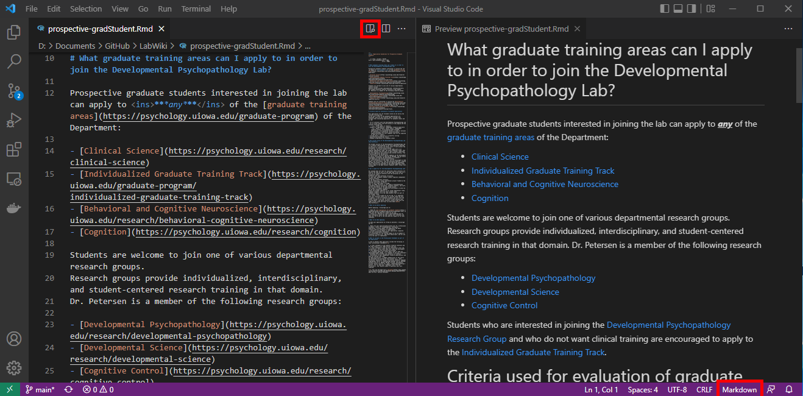

```{r setup, include = FALSE}
knitr::opts_chunk$set(
  echo = TRUE,
  error = TRUE,
  comment = "")
```

# `R` Markdown {#rMarkdown}

## Overview {#overview}

This is an `R `Markdown document.
Markdown is a simple formatting syntax for authoring HTML, PDF, and MS Word documents.
For more details on using `R` Markdown see https://rmarkdown.rstudio.com (archived at https://perma.cc/4MP3-5RT8)

You can embed an `R` code chunk like this:

````markdown
```{r}`r ''`
summary(cars)
```
````

```{r}
summary(cars)
```

## Reference Guide {#referenceGuide}

https://www.rstudio.com/wp-content/uploads/2015/03/rmarkdown-reference.pdf (archived at https://perma.cc/8P7X-9XPV)

# Lab Wiki {#labWiki}

## Best Practices {#bestPractices}

Adapted from [here](https://github.com/lowepowerlab/protocols/blob/main/markdown_best_practices.md; archived at https://perma.cc/P75L-3UM9):

- **Use a new line for every sentence.** 
This helps with version control—individually changed sentences will be highlighted upon commits (easy to parse) rather than whole paragraphs (nightmare to parse).
    - This formatting is incompatible with a double space after a period.
    Instead, use a single space after a period.
    To replace all double spaces with single spaces, do a find and replace for `".  "` → `". "` 
    Be careful not to blanket remove all double spaces because tabbed bullets have 3 spaces.
- Add protocol entries as links to the parent `.Rmd` file (or to `README.md`)
- Add linked content (e.g., images) to sub-directories
- Use no spaces in file or folder names.
Use a dash (-) instead of a space.
- If you use `Visual Studio Code` to edit the Lab Wiki, you can view the source code side-by-side with the markdown Preview (after selecting the code type as `markdown`):

- When making numbered (ordered) lists, just use `1. ` for all numbers.
Markdown will make them sequential automatically.
This is helpful if you go back and add additional entries later.
- Use `"[XXX]"` to indicate an area that needs editing.
This will allow the lab to `CTRL+F` for `"[XXX]"` and find areas that need editing.
- To update the list of `R` packages that are installed for running the `.Rmd` files, update the `DESCRIPTION` file.
- When adding a link to an external (non-lab) URL, add both the original link and the [perma.cc](https://perma.cc) link to prevent link rot (websites will go offline and disappear over time).
For example: http://www.cookbook-r.com/Graphs/Scatterplots_(ggplot2)/ (archived at https://perma.cc/N4TL-JQS4)
You can get a [perma.cc](https://perma.cc) account through the UI Libraries.

## Updating {#updateWiki}

To update the lab wiki, perform the following steps:

1. (Perform this step if you do not already have the the [LabWiki `GitHub` repo](https://github.com/DevPsyLab/LabWiki) on your local machine:) Clone the `GitHub` repo to your local machine.
1. Fetch the latest version of the repo.
It is important to do this to make sure you have the latest version locally before making any changes.
1. Edit the relevant `.Rmd` files using `RStudio` or `Visual Studio Code`.
1. Preview the wiki before you commit changes to the site; create the `.html` files locally (in a folder called `_site`) by running the following command:
   - `rmarkdown::render_site()`
1. If the `.html` files look correct, commit the changes.
1. Push the changes to the `GitHub` repo.
After pushing the changes to the `GitHub` repo, `GitHub Actions` will automatically re-run the code and deploy the updated website, assuming there were no errors.
You can track the workflow for errors here: https://github.com/DevPsyLab/LabWiki/actions.

For more information about the `rmarkdown` package that was used to generate the site, see the following links:

- https://bookdown.org/yihui/rmarkdown/rmarkdown-site.html (archived at https://perma.cc/5C4T-SY9V)
- https://bookdown.org/yihui/rmarkdown/html-document.html (archived at https://perma.cc/WQS5-KH4S)

# Software {#software}

You can create/edit `R` Markdown (`.Rmd`) files with the following free software:

- [`Microsoft Visual Studio Code`](https://code.visualstudio.com)
- [`RStudio`](https://www.rstudio.com)

## Microsoft Visual Studio Code {#vsCode}

If you use `Visual Studio Code` to create/edit `.Rmd` documents, you can view the source code side-by-side with the markdown Preview (after selecting the code type as `markdown`):


## RStudio {#rstudio}

### Creating a Code Chunk {#createCodeChunk}

Add a new chunk by clicking the *Insert Chunk* button on the toolbar or by pressing *Ctrl+Alt+I*.

### Running a Code Chunk {#runCodeChunk}

You can execute a code chunk in an `R` Markdown Notebook by clicking the *Run* button within the chunk or by placing your cursor inside it and pressing *Ctrl+Shift+Enter*.
To run more than one code chunk, you have several options:

- click the *Run* button within the chunks you want to run
- select "Run All Chunks Above"
- select "Run All Chunks Below"
- select "Run All"

### Creating the HTML Output {#htmlOutput}

When you click the **Knit** button, a document will be generated that includes both content as well as the output of any embedded `R `code chunks within the document.

When you save the computational notebook (`.Rmd`), an HTML (`.html`) file containing the code and output will be saved alongside it (click the *Preview* button or press *Ctrl+Shift+K* to preview the HTML file).

The preview shows you a rendered HTML copy of the contents of the editor.
Consequently, unlike *Knit*, *Preview* does not run any `R` code chunks.
Instead, the output of the chunk when it was last run in the editor is displayed.

# Computational Notebook {#computationalNotebook}

## General Info {#general}

You can use an `R` Markdown Notebook to create a computational notebook.
For more information on the value of computational notebooks, see the article titled "[The Scientific Paper Is Obsolete](https://www.theatlantic.com/science/archive/2018/04/the-scientific-paper-is-obsolete/556676/; archived at https://perma.cc/XHW4-K89V)".
For more information about how to create `R` Notebooks, see here:

https://garrettgman.github.io/rmarkdown/r_notebooks (archived at https://perma.cc/L78P-G73Z)

https://bookdown.org/yihui/rmarkdown/notebook.html (archived at https://perma.cc/P5YT-395F)

## Files {#files}

Consistent with the [Petersen Lab template](https://research-git.uiowa.edu/PetersenLab/Template) for how to structure your repo, you should have two computational notebooks: 1) a "Prepare Data" script (`prepareData.Rmd`) and 2) a "Computational Notebook" script (`computationalNotebook.Rmd`).
The "Prepare Data" script is used to update the data file by re-exporting, merging, re-running calculations, etc.
This script should be separate from the "Computational Notebook" file that is used for running analyses on the data.
Every time you run the "Computational Notebook" file with the exact same data, you should get the exact same findings (i.e., reproducibility).
Thus, we keep the "Prepare Data script" separate from the "Computational Notebook" file so that you update the data only when you intend to.

## Structure {#structure}

When creating a computational notebook, follow the structure of the computational notebooks in the [Petersen Lab template](https://research-git.uiowa.edu/PetersenLab/Template).
To create a computational notebook, create a `.Rmd` file with the following `YAML` header at the top of the file:

```yaml
---
title: "INSERT TITLE"
author: "INSERT AUTHOR NAME(S)"
date: "`r knitr::inline_expr("format(Sys.time(), '%d %B, %Y')")`"
output: 
  html_document:
    toc: true
    toc_depth: 4
    toc_float: true
    number_sections: true
    code_folding: show
    df_print: paged
---
```

If this is your "Computational Notebook" script, include the following as the first code chunk:

````markdown
```{r setup, include = FALSE}`r ''`
knitr::opts_chunk$set(
  echo = TRUE, # print code
  error = TRUE # do not interrupt in case of errors
)

# Use for higher quality figures on Windows devices
trace(grDevices::png, quote({
  if (missing(type) && missing(antialias)) {
    type <- "cairo-png"
    antialias <- "subpixel"
  }
}), print = FALSE)
```
````

If this is your "Prepare Data" script, include the following as the first code chunk:

````markdown
```{r setup, include = FALSE}`r ''`
knitr::opts_chunk$set(
  echo = TRUE # print code
)
```
````
Then, include whatever text and/or code chunks.

## Creating CSS Commands {#css}

Personalized commands can be created in Visual Code through the CSS file within the Wiki folder.
To create a new CSS commands:

1. In Visual Studio Code, open the `css` tab within the Wiki Folder

1. Open the `# srs.css` file under the `css` tab

1. Enter in your personalized command according to the following structure:

```
COMMAND_NAME {
  command-specification1: value1;
  command-specification2: value2;
  command-specification3: value3;
  quotes: """ """ "‘" "'";
}
```

1. The following specifications may be added to your command:
   - `font-size`: Value = `percentage`
      - e.g., `font-size: 150%`
   - `font-style`: Value = `bold`, `italic`, `underline`
      - e.g., `font-style: bold`, `font-style: italic`
   - `color`: Value = `color name` or `color code`
      - e.g., `color: green`, `color: #0e6b1c`
   - To edit the command to add quotations, include the following *after* the end bracket of the command: 
      ```
      COMMAND_NAME:before { content: open-quote; }
      COMMAND_NAME:after  { content: close-quote; }
      ```
1. An example of a command is presented here:

```
example {
  font-size: 150%;
  font-style: italic;
  color:#C800FC;
  quotes: """ """ "‘" "'";
}
example:before { content: open-quote; }
example:after  { content: close-quote; }
```

# `rmarkdown`/`Quarto` Website using `GitHub Actions` {#website}

## Steps to Create {#websiteSteps}

1. Create a new `GitHub` repo under the [DevPsyLab organization](https://github.com/DevPsyLab) in GitHub
1. Create the repository using one of the following templates:
    - `rmarkdown`: https://github.com/DevPsyLab/MarkdownWebsite
        - for local rendering: https://github.com/DevPsyLab/MarkdownWebsite-RenderLocal
    - `Quarto`: https://github.com/DevPsyLab/QuartoWebsite
        - for local rendering: https://github.com/DevPsyLab/QuartoWebsite-RenderLocal

If you do not create the repository from a template, the steps for creating the repo manually are below:

1. Create a `README.md` file
    - this is the file that people see when navigating to the repo
1. Add a `.gitignore` file
    - this file says what file types to ignore and not add to the repo
1. Create a new branch called `gh-pages`
1. Delete all files in the `gh-pages` branch
1. Switch back the main branch of the repo, and add the following contents (to the main branch, **not** to the `gh-pages` branch):
    - `/.github/workflows/deploy_markdown.yml` file
        - this file tells `GitHub Actions` was steps to run
        - add the following contents to the file:
            - if using `rmarkdown`:
                - if the website is intended to be public: https://github.com/DevPsyLab/LabWiki/blob/main/.github/workflows/deploy_rmarkdown.yml
                - if the website is intended to be private: https://github.com/DevPsyLab/SchoolReadinessStudy/blob/main/.github/workflows/deploy_rmarkdown.yml
            - if using `Quarto`:
                - if the website is intended to be public: https://github.com/DevPsyLab/QuartoWebsite/blob/main/.github/workflows/publish.yml
                - if the website is intended to be private: https://github.com/DevPsyLab/QuartoWebsite-RenderLocal/blob/main/.github/workflows/publish.yml
    - `YAML` file—this file creates the navbar:
        - if using `rmarkdown`:
            - `_site.yml` file
        - if using `Quarto`:
            - `_quarto.yml` file
    - `LICENSE` file
        - this file is the license
    - `DESCRIPTION` file
        - this file tells `GitHub Actions` what `R` packages to install
1. Add each `.Rmd` file (for `rmarkdown`) or `.qmd` file (for `Quarto`)
1. Add folders for the [`font`](https://github.com/DevPsyLab/LabWiki/tree/main/font), [`images`](https://github.com/DevPsyLab/LabWiki/tree/main/images), and [`includes`](https://github.com/DevPsyLab/LabWiki/tree/main/includes)
    - `includes` contains `css` files, javascript files, footers, and Google Analytics
1. If the `rmarkdown` website is intended to be public, create a new Google Analytics property, and replace the URL and gtag in the `google_analytics.html` file
1. Commit the repo to `GitHub`
1. To deploy the website on `GitHub Pages`:
    1. Make the repo public (Settings > General > Change Visibility)
    1. Activate `GitHub Pages` (Settings > Pages)
        - Source: "Deploy from a Branch"
        - Branch: `gh-pages/root`
        - Click "Save"
    1. Make sure "Read and write permissions" are enabled in Settings -> Actions -> General -> Workflow permissions

## Quarto Manuscripts

- Quarto Journal Templates: https://github.com/quarto-journals
- Sample Manuscripts: https://quarto.org/docs/manuscripts

Example:

- https://github.com/mine-cetinkaya-rundel/indo-rct
    - https://mine-cetinkaya-rundel.github.io/indo-rct/

To prevent code from re-running unless code is altered:

```yaml
execute:
    freeze: auto
```

## Troubleshooting {#troubleshooting}

If you get the following error in `GitHub Actions`:

```
remote: Permission to GITHUB_USERNAME/REPO_NAME.git denied to github-actions[bot].
fatal: unable to access 'https://github.com/GITHUB_USERNAME/REPO_NAME.git/': The requested URL returned error: 403
```

Check if "Read and write permissions" are enabled in Settings -> Actions -> General -> Workflow permissions:
https://stackoverflow.com/a/75308228/2029527 (archived at https://perma.cc/R57Z-9JUS)

# Including Plots {#plots}

You can embed plots, for example:

````markdown
```{r, echo = FALSE}`r ''`
plot(pressure)
```
````

```{r, echo = FALSE}
plot(pressure)
```

Note that the `echo = FALSE` parameter was added to the code chunk to prevent printing of the `R` code that generated the plot.

# Headings {#headings}

## Subheading {#subheading}

### Subsubheading {#subsubheading}

#### Subsubsubheading {#subsubsubheading}

```
# Headings {#heading-label1}

## Subheading {#heading-label2}

### Subsubheading {#heading-label3}

#### Subsubsubheading {#heading-label4}
```

# Lists {#lists}

To add another element in a list while preserving the continuity of the list, indent the element four spaces or one tab.

## Unordered Lists {#unorderedLists}

To create an unordered list, add a dash (-) in front of line items.
Adding an asterisk (*) or plus sign (+) in front of line items will also create an unordered list; however, the lab convention is to use dashes for unordered lists.
We use asterisks for [adding emphasis to text](#emphasis).

````markdown
- one item
- one item
- one item
    - one more item
    - one more item
    - one more item
        - lower level
            - sub-item 1
            - sub-item 2
 ````

- one item
- one item
- one item
    - one more item
    - one more item
    - one more item
        - lower level
            - sub-item 1
            - sub-item 2

### Checkboxes {#checkboxes}

````markdown
- <input type="checkbox" unchecked> Box 1</input>
- <input type="checkbox" checked> Box 2</input>
 ````

- <input type="checkbox" unchecked> Box 1</input>
- <input type="checkbox" checked> Box 2</input>

## Ordered Lists {#orderedLists}

````markdown
1. the first item
    1. test
    1. test
        1. new test
        1. new test
1. the second item
    1. test
    1. test
1. the third item
    - one unordered item
        - subitem
    - one unordered item
1. fourth item
    1. test
    1. test
    1. test
````

1. the first item
    1. test
    1. test
        1. new test
        1. new test
1. the second item
    1. test
    1. test
1. the third item
    - one unordered item
        - subitem
    - one unordered item
1. fourth item
    1. test
    1. test
    1. test
    
# Blockquotes {#blockquotes}

````markdown
> Dorothy followed her through many of the beautiful rooms in her castle.
> 
> Continued...
````

> Dorothy followed her through many of the beautiful rooms in her castle.
> 
> Continued...

# Comments {#comments}

## Markdown {#markdownComments}

````markdown
```markdown
[This is how to write a hidden comment in Markdown.]: # 
```

[This comment will be hidden.]: # 
````

````markdown
[This is how to write a hidden comment in Markdown.]: # 
````

[This comment will be hidden.]: # 

## HTML {#htmlComments}

````html
<!-- This text will be hidden -->

<!--
This multiline
text comment will be
hidden
-->
````

<!-- This text will be hidden -->

<!--
This multiline
text comment will be
hidden
-->

# Emphasis {#emphasis}

````markdown
This text is **bolded text**.
This text is *italicized text*.
This text is ***bolded and italicized text***.
This text is <mark>highlighted text</mark>.
This text is <mark style="background-color: lightblue">highlighted text in a different color</mark>.
This text is `unicode text`.
This text is <code><i>code in italics;</i> this text is <b>code in bold</b></code>.
This text is ~~strikethrough text~~.
This text <u>will be underlined</u>; this text <ins>will also be underlined</ins>.
<font color="red">This text is red!</font>
````

This text is **bolded text**.
This text is *italicized text*.
This text is ***bolded and italicized text***.
This text is <mark>highlighted text</mark>.
This text is <mark style="background-color: lightblue">highlighted text in a different color</mark>.
This text is `unicode text`.
This text is <code><i>code in italics;</i> this text is <b>code in bold</b></code>.
This text is ~~strikethrough text~~.
This text <u>will be underlined</u>; this text <ins>will also be underlined</ins>.
<font color="red">This text is red!</font>

For underlining text, the lab convention is to use: `<u>text to be underlined</u>`.

# Formatting {#formatting}

````markdown
<center>This text is centered.</center>
````

<center>This text is centered.</center>

# Code/Syntax Highlighting {#codeHighlighting}

To use syntax highlighting to display code without running the code:

```` markdown
```r
summary(cars)
```
````

```r
summary(cars)
```

or

````markdown
```{r, eval = FALSE}`r ''`
summary(cars)
```
````

```{r, eval = FALSE}
summary(cars)
```

or

```` markdown
    summary(cars)
````
which yields:

    summary(cars)

# Math Formulas {#formulas}

Inline:

This is the formula: $x = y + 5$. Solve for $x$.

Separate line:

````markdown
$$
y = \frac{x}{7} \cdot 4 + 3 \times 2 - 1_{a1}/2^{1c/2} \dots
$$
````


$$
y = \frac{x}{7} \cdot 4 + 3 \times 2 - 1_{a1}/2^{1c/2} \dots
$$

# Links {#links}

````markdown
[I'm an inline-style link](https://www.google.com)

[I'm an inline-style link with title](https://www.google.com "Google's Homepage")

[I'm a reference-style link][Arbitrary case-insensitive reference text]

[I'm a relative reference to a repository file](../blob/master/LICENSE)

[You can use numbers for reference-style link definitions][1]

[I am a link to another file in this project](pca.html#overview)

[I'm a link within this document](#headings)

[I'm a link that opens in a new tab](https://example.com){target="_blank"}

URLs and URLs in angle brackets will automatically get turned into links. 
http://www.example.com or <http://www.example.com>

Some text to show that the reference links can follow later.

[arbitrary case-insensitive reference text]: https://www.mozilla.org
[1]: https://slashdot.org/

[](https://developmental-psychopathology.lab.uiowa.edu/)
````

[I'm an inline-style link](https://www.google.com)

[I'm an inline-style link with title](https://www.google.com "Google's Homepage")

[I'm a reference-style link][Arbitrary case-insensitive reference text]

[I'm a relative reference to a repository file](../blob/master/LICENSE)

[You can use numbers for reference-style link definitions][1]

[I am a link to another file in this project](pca.html#overview)

[I'm a link within this document](#headings)

[I'm a link that opens in a new tab](https://example.com){target="_blank"}

URLs and URLs in angle brackets will automatically get turned into links. 
http://www.example.com or <http://www.example.com>

Some text to show that the reference links can follow later.

[arbitrary case-insensitive reference text]: https://www.mozilla.org
[1]: http://slashdot.org

Link from an image: 

[](https://developmental-psychopathology.lab.uiowa.edu/)


# Footnotes {#footnotes}

````markdown
Here is a simple footnote[^1].

A footnote can also have multiple lines[^2].  

You can also use words, to fit your writing style more closely[^note].

[^1]: My reference.
[^2]: Every new line should be prefixed with 2 spaces.  
  This allows you to have a footnote with multiple lines.
[^note]:
    Named footnotes will still render with numbers instead of the text but allow easier identification and linking.  
    This footnote also has been made with a different syntax using 4 spaces for new lines.
````

Here is a simple footnote[^1].

A footnote can also have multiple lines[^2].  

You can also use words, to fit your writing style more closely[^note].

[^1]: My reference.
[^2]: Every new line should be prefixed with 2 spaces.  
  This allows you to have a footnote with multiple lines.
[^note]:
    Named footnotes will still render with numbers instead of the text but allow easier identification and linking.  
    This footnote also has been made with a different syntax using 4 spaces for new lines.

# Symbols {#symbols}

````markdown
- degree: (°) &#176;
````
- degree: (°) &#176;

## Arrows {#arrows}

````markdown
- left arrow: ← &#8592;
- upward arrow: ↑ &#8593;
- right arrow: → &#8594;
- downward arrow: ↓ &#8595;
````

- left arrow: ← &#8592;
- upward arrow: ↑ &#8593;
- right arrow: → &#8594;
- downward arrow: ↓ &#8595;

## Dashes and Hyphens {#dashes}

````markdown
- hyphen: -
- en dash: –
- em dash: —
````

- hyphen: -
- en dash: –
- em dash: —

## Subscript/Superscript {#subSuperscript}

### Markdown {#markdownSubSuperscript}

````markdown
H~2O
X^2
````

H~2O

X^2

### HTML {#htmlSubSuperscript}

````html
H<sub>2</sub>O
X<sup>2</sup>
````

H<sub>2</sub>O

X<sup>2</sup>

## Definition List {#definitions}

````markdown
term
: definition
````

term
: definition

## Task list {#taskList}

````markdown
- [x] Create the website
- [ ] Conduct the study
- [ ] Write it up
````

- [x] Create the website
- [ ] Conduct the study
- [ ] Write it up

# Table {#table}

````markdown
| Syntax      | Description |
| ----------- | ----------- |
| Header      | Title |
| Paragraph   | First paragraph. <br><br> Second paragraph. |

| Syntax      | Description |
| ----------- | ----------- |
| Header      | Title |
| List        | Here's a list! <ul><li>Item one.</li><li>Item two.</li></ul> |
````

| Syntax      | Description |
| ----------- | ----------- |
| Header      | Title |
| Paragraph   | First paragraph. <br><br> Second paragraph. |

| Syntax      | Description |
| ----------- | ----------- |
| Header      | Title |
| List        | Here's a list! <ul><li>Item one.</li><li>Item two.</li></ul> |

You can easily create tables in Markdown from an Excel or csv file using the following website:
https://www.tablesgenerator.com/markdown_tables (archived at https://perma.cc/53TQ-DQJ9)

# Adding a Drop Down List {#dropDownList}

**Note:**: When creating dropdown menus, it is important to have spaces between font breaks `</font>`.
Without these breaks, Markdown cannot detect how to 

````markdown 

<details>
<summary>**<font size = "6">This is a dropdown menu**</summary>

<font size = "4">

Insert Text Here

</font>
</details>
````
<details>
<summary>**<font size = "6">This is a dropdown menu** 

</font>

</summary>

<font size = "4">

Insert Text Here

</font>

</details>

<br>
<br>

# Embedding a Picture {#picture}

```markdown

```

For instance:

```markdown

```

# Embedding a Video {#video}

- First, make sure the repository is configured for large file storage.
Follow the instructions [here](git.html#gitLfs) to do so.

- A helpful example repository for embedding videos can be found [here](https://github.com/PLAY-behaviorome/PLAY-project.org/blob/master/collection_homevisit.Rmd; archived at https://perma.cc/6RWF-PNR7)

```markdown
<video width="100%" controls="" preload="none"> #video settings
<source src="images/lv2-saving-procedures.mp4" type="video/mp4"> #location and type of video
</video>
```

# Embedding a pdf in a markdown document {#pdf}

PDF's can be embedded within markdown documents.
Make sure the document you wish to embed is in a local folder (if you are adding it to a Wiki document). <br>

- **Note:** Height and width can be adjusted to fit the page

```markdown
<embed src="path to file" width="1000" height="600">
```

# Embedding a html file within a markdown document {#htmlEmbed}

The below line of code will embed a html document in a markdown file.
The best way to configure formatting for this is still in progress. <br>

**Note:** The `htmltools` package will need to be installed as a package dependency

```markdown
htmltools::includeHTML("path to html file")
```

# Converting Word Documents to Markdown {#Word}

The process of converting word documents to Markdown is aided by having knowledge of the [best practices](#bestPractices) steps.

To convert documents, follow these steps:

1. Open both word doc to be converted and new markdown document
1. Copy and paste the text to convert
1. Follow the [best practices](#bestPractices) to convert the document to Markdown format
   -  For example, in the manuals for the School Readiness Study, each [new header](#headings) should denote a new task
1. **Importantly, each sentence will correspond to one line in markdown.**
To convert sentences out of paragraph form: 
   - Press `Ctrl f`
   - search `. `
   - Next, click the arrow on the left side of the search window to open up the replace function in Visual Studio Code.
   - The goal of this process is to create one sentence per line.
   Creating one sentence per line.
   By using one sentence for line, changes can be tracked easier.
   - In the `Replace` line, type `Ctrl Enter` to create a new line.
   - Go through each find to determine if a new line should be created.
**Do not replace all**.
Bulleted lists may also contain a `. ` that should not be removed.

# Video formatting for Wiki {#videoFormatting}

[Handbrake](https://handbrake.fr) can be used to lower video quality, and convert files to `.mp4` format, in order for them to be incorporated into the wiki.
It is important to lower the quality (i.e., file size) of videos so that we do not exceed the 1gb file size limit on any given repo.

## Lowering File Size {#lowerFileSize}

- Open Handbrake and drag and drop the video that you would like to lower the file size of.
- Select the `video` tab and lower the `Constant Quality` to `30`, and the `Framerate (FPS):` to `20`
   - We have found this lowers file size, but saves video quality
